# 第一章 简介

客户与服务器使用TCP在同一个以太网中通信

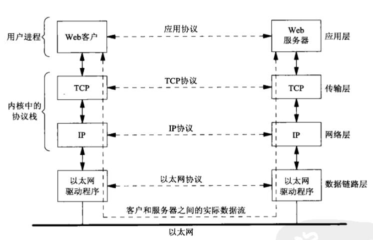

## 1.1 一个简单的时间获取客户程序

代码：C: [daytimetcpcli]() C++: [daytimetcpcli]()

## 1.2 一个简单的时间获取服务器程序

代码：C: [daytimetcpsrv]() C++: [daytimetcpsrv]()

## 1.3 OSI模型

OSI模型和网际协议族中的各层

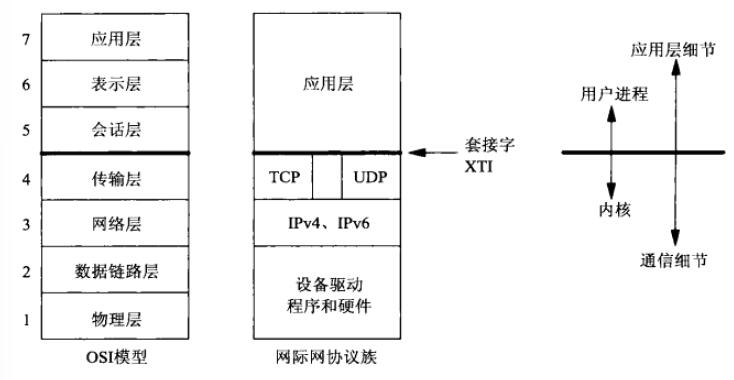

## 1.4 测试网络

- netstat -i  提供网络接口的信息。指定-n标志以输出数值地址。
- netstat -r  展示路由表，也是另一种确定接口的方法。
- ifconfig    获得每个接口的详细信息。
- ping        找出本地网络中众多主机的IP地址

# 第二章 传输层 TCP和UDP

## 2.1 概述

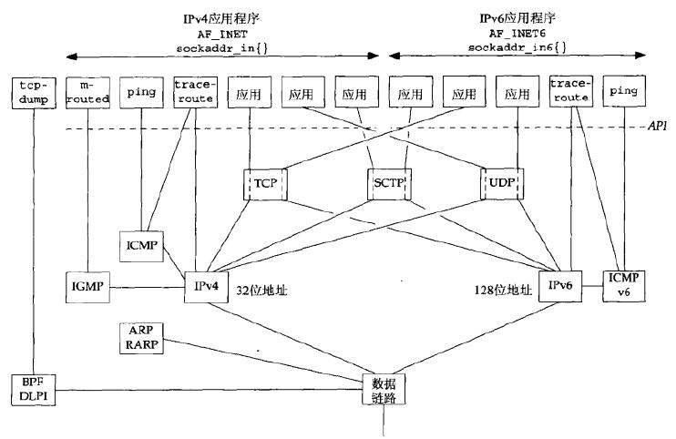

TCP/IP协议概况：

- IPv4  
网际协议版本4 (Internet Protocol version 4)。IPv4（通常称之为IP）是网际协议族的主力协议。它使用32位地址。IPv4给TCP、UDP、SCTP、ICMP和IGMP提供分组递送服务。
- IPv6  
网际协议版本6 (Internet Protocol version 6)。IPv6是为IPv4的一个替代品设计的。其主要变化是使用128位更大地址。IPv6给TCP、UDP、SCTP和ICMPv6提供分组递送服务。
- TCP   
传输控制协议(Transmission Control Protocol)。 TCP是一个面向连接的协议，为用户进程提供可靠的全双工字节流。TCP套接字是一种流套接字( streamsocket)。TCP关心确认、超时和重传之类的细节。大多数因特网应用程序使用TCP。注意TCP既可以使用IPv4，也可以使用IPv6。
- UDP   
用户数据报协议(User Datagram Protocol)。UDP是一个无连接协议。UDP套接字是一-种数据报套接字(datagram socket）。UDP数据报不能保证最终到达它们的目的地。与TCP一样，UDP既可以使用IPv4，也可以使用IPv6。
- SCTP  
流控制传榆协议(Stream Control Transmission Protocol)。SCTP是一个提供可靠全双工关联的面向连接的协议，我们使用“关联”一词来指称SCTP中的连接,因为SCTP是多宿的，从而每个关联的两端均涉及一组IP地址和一个端口号。SCTP提供消息服务，也就是维护来自应用层的记录边界。与TCP和UDP一样，SCTP既可以使用IPv4，也可以使用IPv6，而且能够在同一个关联中同时使用它们。
- ICMP  
网际控制消息协议（Internet Control Message Protocol)。ICMP处理在路由器和主机之间流通的错误和控制消息。这些消息通常由TCP/IP网络支持软件本身(而不是用户进程)产生和处理，不过图中展示的ping和traceroute程序同样使用ICMP。有时我们称这个协议为ICMPv4，以便与ICMPv6相区别。
- IGMP  
网际组管理协议(Internet Group Management Protocol )。IGMP用于多播，它在IPv4中是可选的。
- ARP   
地址解析协议（Address Resolution Protocol)。ARP把一个IPv4地址映射成一个硬件地址（如以太网地址)。ARP通常用于诸如以太网、令牌环网和FDDI等广播网络，在点到点网络上并不需要。
- RARP  
反向地址解析协议(Reverse Address Resolution Protocol)。RARP把一个硬件地址映射成一个IPv4地址。它有时用于无盘节点的引导。
- ICMPv6    
网际控制消息协议版本6 (Internet Control Message Protocol version 6)。ICMPv6综合了ICMPv4、IGMP和1ARP的功能。
- BPF   
BSD分组过滤器(BSD packet filter)。该接口提供对于数据链路层的访问能力,通常可以在源自Berkeley的内核中找到。
- DLPI  
数据链路提供者接口(datalink provider interface)。该接口也提供对于数据链路层的访问能力，通常随SVR4内核提供。

## 2.2 用户数据报协议(UDP)

UDP不保证UDP数据报会到达其最终目的地，不保证各个数据报的先后顺序跨网络后保持不变，也不保证每个数据报只到达一次。它缺乏可靠性，提供无连接的服务。

## 2.3 传输控制协议(TCP)

TCP 提供了可靠性，它提供的是数据的可靠递送或故障的可靠通知。再次,TCP提供流量控制（flow control)，TCP总是告知对端在任何时刻它一次能够从对端接收多少学节的数据，这称为通告窗口(advertised window)。最后，TCP连接是全双工的(full-duplex)。这意味着在一个给定的连接上应用可以在任何时刻在进出两个方向上既发送数据又接收数据。

## 2.4 TCP连接的建立和终止

### TCP连接（三次握手）

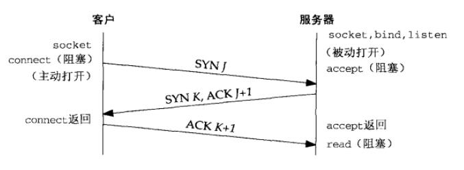

1. 服务器必须准备好接受外来的连接。通过调用socket、bind和listen这3个函数来完成，我们称之为被动打开（passive open)。
2. 客户通过调用connect发起主动打开(active open),这导致客户TCP发送一个SYN（同步）分节，它告诉服务器客户将在（待建立的）连接中发送的数据的初始序列号。通常SYN分节不携带数据，其所在IP数据报只含有一个IP首部、一个TCP首部及可能有的TCP选项。
3. 服务器必须确认（ACK）客户的SYN，同时自己也得发送一个SYN分节，它含有服务器将在同一连接中发送的数据的初始序列号。服务器在单个分节中发送SYN和对客户SYN的ACK(确认)。
4. 客户必须确认服务器的SYN。

### TCP选项

- MSS选项     
发送SYN的TCP一端使用本选项通告对端它的最大分节大小(maximumsegment size)即MSS，也就是它在本连接的每个TCP分节中愿意接受的最大数据量。
- 窗口规模选项      
TCP连接任何一端能够通告对端的最大窗口大小是65535，因为在TCP首部中相应的字段占16位。
- 时间戳选项      
这个选项对于高速网络连接是必要的，它可以防止由失而复现的分组可能造成的数据损坏。

### TCP连接终止（四次挥手）


1. 某个应用进程首先调用close，我们称该端执行主动关闭（active close)。该端的TCP于是发送一个FIN分节,表示数据发送完毕。
2. 接收到这个FIN的对端执行被动关闭( passive close),这个FIN由TCP确认。它的接收也作为一个文件结束符（end-of-file）传递给接收端应用进程（放在已排队等候该应用进程接收的任何其他数据之后)，因为FIN的接收意味着接收端应用进程在相应连接上再无额外数据可接收。
3. 一段时间后，接收到这个文件结束符的应用进程将调用close关闭它的套接字。这导致它的TCP也发送一个FIN。
4. 接收这个最终FIN的原发送端TCP（即执行主动关闭的那一端)确认这个FIN。

### TCP状态转换图


自ESTABLISHED状态引出的两个箭头处理连接的终止。如果某个应用进程在接收到一个FIN之前调用close（主动关闭)，那就转换到FIN_WAIT_1状态。但如果某个应用进程在ESTABLISHED状态期间接收到一个FIN（被动关闭)，那就转换到CLOSE_WAIT状态。


### 观察分组

TCP连接的分组交换

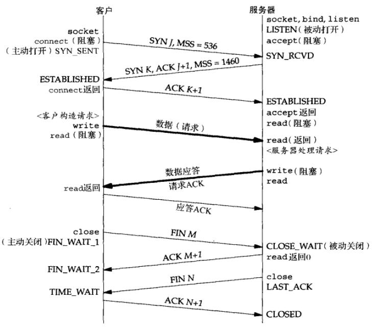

### TIME_WAIT状态

TIME_WAIT状态的持续时间是最长分节生命期(maximum segment lifetime，MSL)的两倍(2MSL)，持续时间在1分钟到4分钟之间.MSL是任何IP数据报能够在因特网中存活的最长时间.

TIME_WAIT状态有两个存在的理由:
1. 可靠地实现TCP全双工连接的终止;
> 执行主动关闭的那一端是处于TIME_WAIT状态的那一端:因为可能不得不重传最终那个ACK
2. 允许老的重复分节在网络中消逝。
> TCP必须防止来自某个连接的老的重复分组在该连接已终止后再现

## 2.5 端口号

- 服务端定义了一组众所周知的端口(well-known port)，用于标识众所周知的服务。
- 客户通常使用短期存活的临时端口(ephemeral port)。

**端口号的分配**

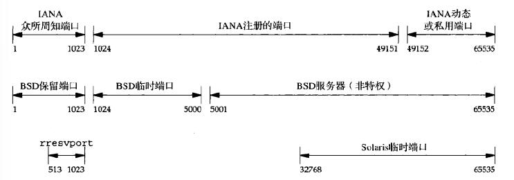

1. 众所周知的端口为0～1023。这些端口由IANA分配和控制。
2. 已登记的端口(registered port)为1024~49151。这些端口不受IANA控制，不过由IANA登记并提供它们的使用情况清单，以方便整个群体。
3. 49152~65535是动态的（dynamic）或私用的（private）端口。IANA不管这些端口。临时端口

**套接字对**

一个TCP连接的套接字对(socket pair)是一个定义该连接的两个端点的四元组:本地P地址、本地TCP端口号、外地IP地址、外地TCP端口号。

标识每个端点的两个值（IP地址和端口号）通常称为一个套接字。

## 2.6 缓冲区大小及限制

- IPv4数据报的最大大小是65535字节，包括IPv4首部。
- IPv6数据报的最大大小是65575字节，包括40字节的IPv6首部。
- 许多网络有一个可由硬件规定的MTU（最大传输单元）。以太网的MTU是1500字节。IPv4要求的最小链路MTU是68字节。IPv6要求的最小链路MTU为1280字节。
- 在两个主机之间的路径中最小的MTU称为路径MTU(path MTU)。1500字节的以太网MTU是当今常见的路径MTU。
- 当一个IP数据报将从某个接口送出时，如果它的大小超过相应链路的MTU，IPv4和IPv6都将执行分片( fragmentation)。
- IPv4首部的“不分片(don 't fragment)”位(即DF位）若被设置，那么不管是发送这些数据报的主机还是转发它们的路由器，都不允许对它们分片。
- IPv4和IPv6都定义了最小重组缓冲区大小(minimum reassembly buffer size)，它是IPv4或IPv6的任何实现都必须保证支持的最小数据报大小。其值对于TPv4为576字节，对于IPv6为1500字节。
- TCP有一个MSS (maximum segment size，最大分节大小)，用于向对端TCP通告对端在每个分节中能发送的最大TCP数据量。

### TCP输出

应用进程写TCP套接字时涉及的步骤和缓冲区

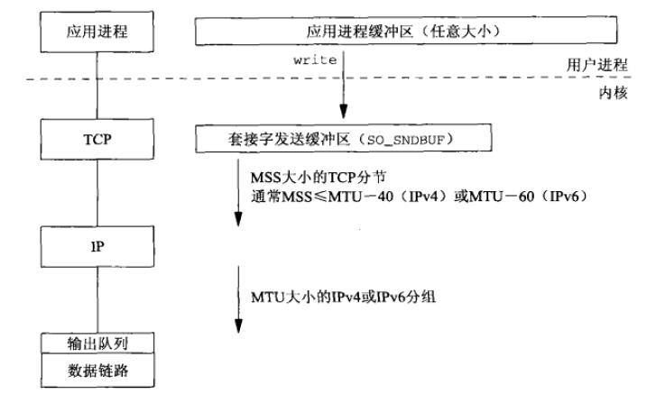

每一个TCP套接字有一个发送缓冲区，可以使用SO_SNDBUF套接字选项来更改该缓冲区的大小.

### UDP输出

应用进程写UDP套接字时涉及的步骤和缓冲区

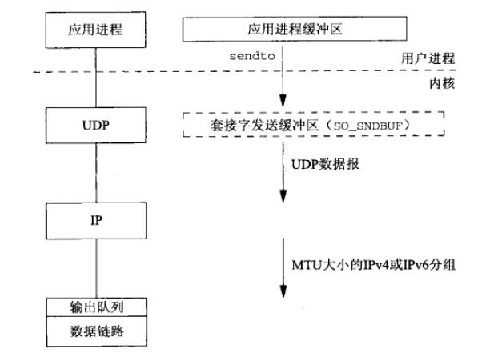

## 2.7 标准因特网服务

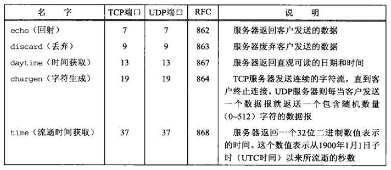

# 第三章 套接字编程简介

## 3.1 套接字地址结构

### IPv4套接字地址结构

IPv4套接字地址结构以sockaddr_in命名，定义在`<netinet/in.h>`头文件中。
```c++
struct in_addr {
    in_addr_t   s_addr ;            /*32-bit IPv4 address */
                                    /*network byte ordered */
};
struct sockaddr_in {
    uint8_t         sin_len;        /*length of structure (16)*/
    sa_family_t     sin_family;     /*AF_INET*/
    in_port_t       sin_port;       /*16-bit TCP or UDP port number */
                                    /*network byte ordered */
    struct in_addr  sin_addr;       /*32-bit IPv4address */
                                    /*network byte ordered */
    char            sin_zero[8];    /*unused*/
};
```
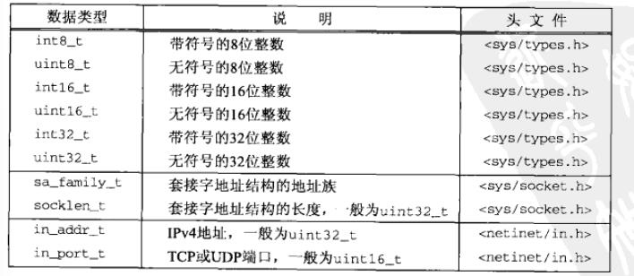

### 通用套接字地址结构

`<sys/socket.h>头文件`
```c++
struct sockaddr {
    uint8_t     sa_len;    
    sa_family_t sa_family;      /*address fanily : AF_xxx va1ue */
    char        sa_data[14];    /*protocol-apecific address */
};
```
这要求对套接字函数的任何调用都必须要将指向特定于协议的套接字地址结构的指针进行类型强制转换，变成指向某个通用套接字地址结构的指针，例如:
```c++
int bind(int, struct sockaddr * ,socklen_t} ;

struct sockaddr_in serv;    /*IPv4 socket address structure */
/*fill in serv{ } */
bind (sockfd,(struct sockaddr *)&serv,sizeof(serv));
```
## 3.2 值-结果参数

1. 从进程到内核传递套接字地址结构

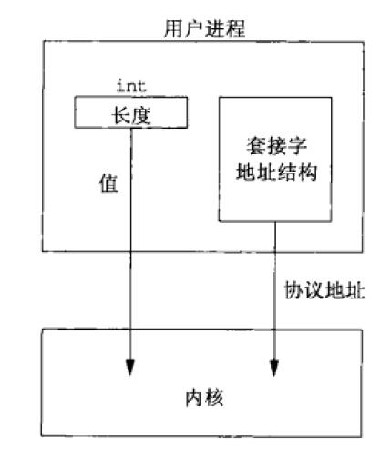

从进程到内核传递套接字地址结构的函数有3个: bind、connect和sendto。这些函数的一个参数是指向某个套接字地址结构的指针，另一个参数是该结构的整数大小。
> 既然指针和指针所指内容的大小都传递给了内核，于是内核知道到底需从进程复制多少数据进来。

```c++
struct sockaddr_in  serv;
/*fill in serv{}*/
connect (sockfd,(struct sockaddr*)&serv. sizeof(serv);
```

2. 从内核到进程传递套接字地址结构

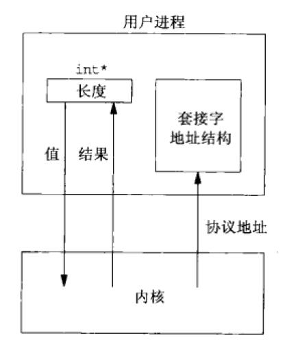

从内核到进程传递套接字地址结构的函数有4个: accept、recvfram、getsockname和getpeername。这4个函数的其中两个参数是指向某个套接字地址结构的指针和指向表示该结构大小的整数变量的指针。
```c++
struct sockaddr_un  cli;/*Unix domain */
socklen_t len;

len = sizeof(cli);     /* len is a value */
getpeername (unixfd,(struct sockaddr *)&cli, &len) ;
/*len may have changed */
```
把套接字地址结构大小这个参数从一个整数改为指向某个整数变量的指针，其原因在于:       
> 当函数被调用时，结构大小是一个值(value)，它告诉内核该结构的大小，这样内核在写该结构时不至于越界;当函数返回时，结构大小又是一个结果(resut)，它告诉进程内核在该结构中究竟存储了多少信息。这种类型的参数称为值-结果（value-result）参数。

## 3.3 字节排序函数

考虑一个16位整数，它由2个字节组成。内存中存储这两个字节有两种方法:
- 一种是将低序字节存储在起始地址，这称为小端(little-endian）字节序;
- 另一种方法是将高序字节存储在起始地址,这称为大端(big-endian）字节序。

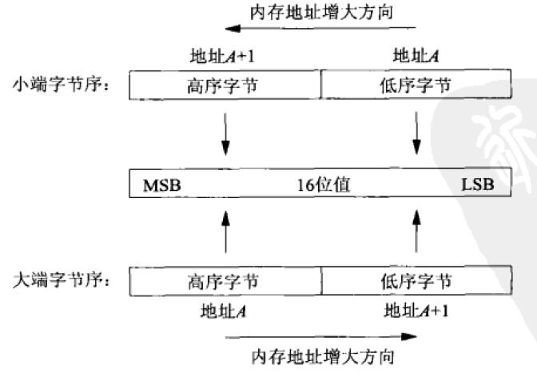

确定主机字节序的程序: [byteorder]()

主机字节序和网络字节序之间转换函数：
```c++
#include <netinet/in.h>
uint16_t htons (uint16_t host16bitvlue);
uint32_t htonl (uint32_t host32bitvalue);   /*均返回:网络字节序的值*/

uint16_t ntohs (uint16_t net16bitvalue);
uint32_t ntohl (uint32_t net32bitvalue);    /*均返回:主机字节序的值*/
```
> h代表host，n代表network，s代表short(16位)，l代表long(32位)

## 3.4 字节操纵函数

**Berkeley函数(BSD)**
```c++
#include <strings.h>
void bzero (void *dest ,size_t nbytes );
void bcopy (const void *src,void *dest, size_t nbytes );
int bcmp (const void *ptr1, const void *ptr2 , size_t nbytes);
/*返回:若相等则为0，否则为非O*/
```
- bzero把目标字节串中指定数目的字节置为0。(初始化套接字地址结构)
- bcopy将指定数目的字节从源字节串移到目标字节串。
- bcmp 比较两个任意的字节串，若相同则返回值为0，否则返回值为非0。

**ANSI C函数**
```c++
#include <string.h>
void *memset (void *dest,int c,size_t len) ;
void *memcpy (void *dest,const void *src,size_t nbytes ) ;
int memcmp(const void *ptr1,const void *ptr2,size_t nbytes) ;
/*返回:若相等则为0，否则为非O*/
```
- memset把目标字节串指定数目的字节置为值c。
- mermcpy类似bcopy，不过两个指针参数的顺序是相反的。当源字节串与目标字节串重叠时，bcopy能够正确处理，但是memcpy的操作结果却不可知。(改用memmove函数)。
- memcmp比较两个任意的字节串，若相同则返回0，否则返回一个非0值，是大于0还是小于0则取决于第一个不等的字节:如果ptr1所指字节串中的这个字节大于ptr2所指字节中的对应字节，那么大于0，否则小于0。(前提:两个不等的字节均为无符号字符(unsigned char))

## 3.5 地址转换函数

```c++
#iniclude <arpa/inet.h>
int inet_aton(const char *strptr,struct in_addr *addrptr) ;
/*返回:若字符串有效则为1，否则为0*/
in_addr_t inet_addr (const char *strptr ) ; /*废弃*/
/*返回:若字符串有效则为32位二进制网络字节序的IPv4地址，否则为工NADDR_NONE*/
char *inet_ntoa (struct in_addr inaddr ) :
/*返回:指向一个点分十进制数串的指针*/
```
- inet_ator将strptr所指C字符串转换成一个32位的网络字节序二进制值，并通过指针addrptr来存储。若成功则返回1，否则返回0。
- inet_addr进行相同的转换，返回值为32位的网络字节序二进制值。(不能处理255.255.255.255，已被废弃)
- inet_ntoa函数将一个32位的网络字节序二进制IPv4地址转换成相应的点分十进制数串。

IPv6出现的新函教:(适用于IPv4地址和IPv6地址)     
```c++
include <arpa/inet.h>
int inet_ptcn(int family,corst char *strpir ,void *addrptr ) ;
/*返回:若成功则为1，若输入不是有效的表达格式则为0，若出错则为-1*/
const char *inet_ntop (int family，const void *addrptr,char *strptr,size_t len);
/*返回:若成功则为指向结果的指针，若出错则为NULL*/
```
> p和n分别代表表达( presentation）和数值（numeric)。
- inet_ptcn 函数尝试转换由strptr指针所指的字符串，并通过addrptr指针存放二进制结果。若成功则返回值为1，否则如果对所指定的family而言输入的字符串不是有效的表达格式，那么返回值为0。
- inet_ntop 函数进行相反的转换，从数值格式(addrptr）转换到表达格式(strptr)。len参数是目标存储单元的大小，以免该函数溢出其调用者的缓冲区。

## 3.6 字节流套接字函数
```c++
#include <unistd.h>
#include <errno.h>
ssize_t readn ( int filedes,void *buff,size_t nbytes ) ;
ssize_t written(int filedes ,const void *buff ,size_t nbytes ) ;
ssize_t readline(int filedes,void *buff, size_t maxlen) ;
/*均返回:读或写的字节数，若出错则为-1*/
```
- [readn]()
- [written]()
- [readline]()

# 第四章 基本TCP套接字编程

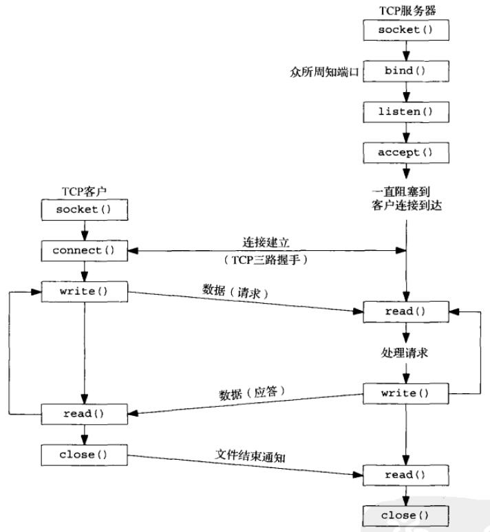

## 4.1 socket函数
为了执行网络IO，一个进程必须做的第一件事情就是调用socket函数，指定期望的通信协议类型。
```c++
#include <sys/socket.h>
int socket(int family, ine type, int protocol);
/*返回:若成功则为非负描述符,若出错则为-1*/
```
- family参数指明协议族

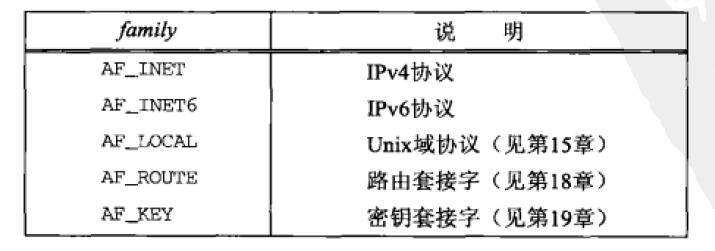

- type参数指明套接字类型

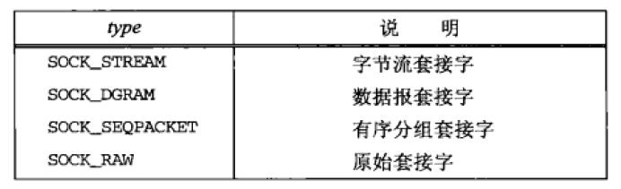

- protocol参数应设为某个协议类型常值，或者设为0，以选择所给定family和type组合的系统默认值。

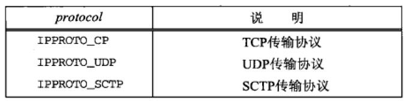

- 并非所有套接字family与type的组合都是有效的

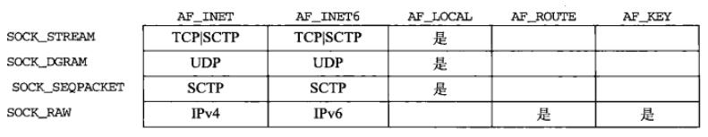

## 4.2 connect函数
TCP客户用connect函数来建立与TCP服务器的连接。
```c++
#include <sys/socket.h>
int connect (int sockfd,const struct sockaddr *servaddr,socklen_t addrlen);
/*返回:若成功则为0，若出错则为-1*/
```
- sockfd是由socket函数返回的套接字描述符
- servaddr和addrlen分别是一个指向套接字地址结构的指针和该结构的大小

> 客户在调用函数connect前不必非得调用bind函数，因为如果需要的话，内核会确定源IP地址，并选择一个临时端口作为源端口。

出错返回的几种情况：  

1. 若TCP客户没有收到SYN分节的响应，则返回ETIMEDOUT错误。
2. 若对客户的SYN的响应是RST(表示复位)，则表明该服务器主机在我们指定的端口上没有进程在等待与之连接。这是一种硬错误(hard error)，客户一接收到RST就马上返回ECONNREFUSED错误。
3. 若客户发出的SYN在中间的某个路由器上引发了一个“destination unreachable”(目的地不可达）ICMP错误，则认为是一种软错误(soft error)。

connect函数导致当前套接字从CLOSED状态（该套接字自从由socket函数创建以来一直所处的状态）转移到SYN_SENT状态，若成功则再转移到ESTABLISHED状态。若connect失败则该套接字不再可用，必须关闭，我们不能对这样的套按字再次调用connect函数。

## 4.3 bind函数

bind函数把一个本地协议地址赋予一个套接字。对于网际网协议，协议地址是32位的IPv4地址或128位的IPv6地址与16位的TCP或UDP端口号的组合。
```c++
#include <sye/socket.h>
int bind(int sockfd,const struct sockaddr *myaddr,socklen_t addrlen);
/*返回:若成功则为0，若出错则为-1*/
```
- sockfd是由socket函数返回的套接字描述符
- myaddr和addrlen分别是一个指向特定于协议的地址结构的指针和该地址结构的长度
> 对于TCP，调用bind函数可以指定一个端口号，或指定一个IP地址，也可以两者都指定，还可以都不指定。

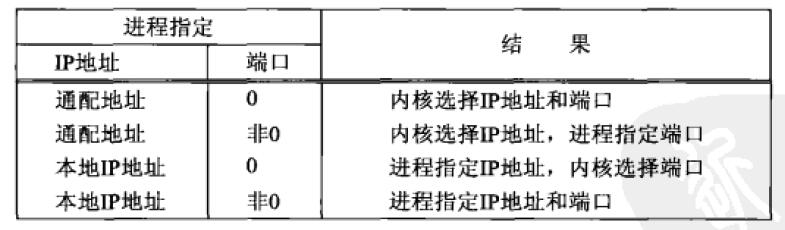

- 如果指定端口号为0，那么内核就在bind被调用时选择一个临时端口
- 如果指定IP地址为通配地址，那么内核将等到套接字已连接（TCP）或己在套接字上发出数据报（UDP）时才选择一个本地IP地址。
> 对于IPv4来说，通配地址由常值INADDR_ANY来指定，其值一般为0.
```c++
struct sockaddr_in servaddr ;
servaddr.sin_addr.s_addr = htorl(INADDR_ANY) ;/*wildcard * /
```
> - 可以调用函数getsockname来返回协议地址和端口值
> - 从bind函数返回的一个常见错误是EADDRINUSE (地址已使用)

## 4.4 listen函数
当socket函数创建一个套接字时，它被假设为一个主动套接字，也就是说，它是一个将调用connect发起连接的客户套接字。listen函数把一个未连接的套接字转换成一个被动套接字，指示内核应接受指向该套接字的连接请求。调用listen导致套接字从CLOSED状态转换到LISTEN状态。
```c++
include <sys/socket.h>
int listert int sockfd,int backlog) ;
/*返回:若成功则为0，若出错则为-1*/
```
- sockfd是由socket函数返回的套接字描述符
- backlog规定了内核应该为相应套接字排队的最大连接个数。

内核为任何一个给定的监听套接字维护两个队列:
- 未完成连接队列(incomplete connection queue)
   > 每个这样的SYN分节对应其中一项:已由某个客户发出并到达服务器，而服务器正在等待完成相应的TCP三路握手过程。这些套接字处于SYN_RCVD状态（图2-4)。
- 已完成连接队列(completed connection queue)
   > 每个已完成TCP三路握手过程的客户对应其中一项。这些套接字处于ESTABLISHED状态

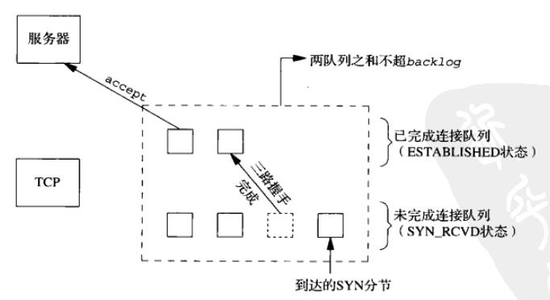

## 4.5 accept函数

accept函数由TCP服务器调用,用于从已完成连接队列队头返回下一个已完成连接。如果已完成连接队列为空，那么进程被投入睡眠(假定套接字为默认的阻塞方式)。
```c++
#include <sys/socket.h>
int accept (int sockfd,struct sockaddr * cliaddr,socklen_t *addrlen ) ;
/*返回:若成功则为非负描述符，若出错则为-1*/
```
- sockfd是由socket函数返回的套接字描述符（监听描述符）
- cliaddr和addrlen用来返回已连接的对端进程（客户）的协议地址(addrlen是值-结果参数)。

如果accept成功，那么其返回值是由内核自动生成的一个全新描述符，代表与所返回客户的TCP连接(已连接套接字描述符)。

## 4.6 fork和exec函数
该函数（包括有些系统可能提供的它的各种变体）是Unix中派生新进程的唯一方法。
```c++
#include <unistd.h>
pid_t fork (void) :
/*返回:在子进程中为0，在父进程中为子进程ID,若出错则为-1*/
```
- 在调用进程（称为父进程）中返回一次，返回值是新派生进程（称为子进程）的进程ID号;
- 在子进程又返回一次，返回值为0。

父进程中调用fork之前打开的所有描述符在fork返回之后由子进程分享。通常情况下，子进程接着读写这个己连接套接字，父进程则关闭这个已连接套接字。

fork有两个典型用法：    
1. 一个进程创建一个自身的副本,这样每个副本都可以在另一个副本执行其他任务的同时处理各自的某个操作。这是网络服务器的典型用法。
2. 一个进程想要执行另一个程序。既然创建新进程的唯一办法是调用fork，该进程于是首先调用fork创建一个自身的副本，然后其中一个副本（通常为子进程）调用exec把自身替换成新的程序。这是诸如shell之类程序的典型用法。

存放在硬盘上的可执行程序文件能够被Unix执行的唯一方法是:由一个现有进程调用六个exec函数中的某一个。
```c++
#include <unistd.h>
int execl  (const char *pathname,const char *arg0,... /*(char *) 0*/ );
int execv  (const char *pathname,char *const *arg [] );
int execle (const char *pathnane,const char *arg0, .../*(char *) 0, char *const envp []*/) :
int execve (const char *pathnanme,char *const argv[],char *const envp []);
int execlp (const char *filename,const char *arg0,.... /* (char *) 0 */);
int execvp (const char *filenrame, char *const argv[]);
```
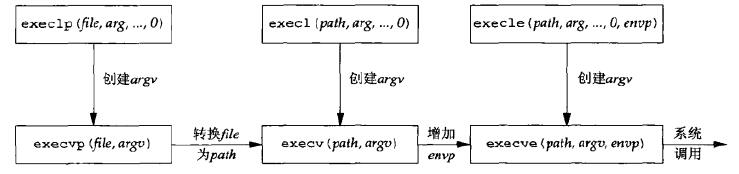

## 4.7 并发服务器

典型的并发服务器程序轮廓：
```c++
pid_t pid;
int listenfd, connfd;
listenfd = socket ( ... ) ;
        /*fill in sockaddr_in{ } with server 's well-known port */
bind (listenfd,... ) ;
listen (listenfd,LISTENQ) ;
for ( ; ; ) {
    connfd = Accept (listenfd, ... );/*probably blocks */
    if (pid = Fork()) == 0) {
        close(listenfd);    /*child closes listening soczket */
        doit(connfd);       /*process the request*/
        close(connfd);      /*done with this client */
        exit(0);            /*child terminates */
    }
    close (connfd) ;        /*parent closes connected socket*/
}
```
## 4.8 close函数
Unix close函数也用来关闭套接字，并终止TCP连接。
```c++
#include <unistd.h>
int close (int sockfd ) ; /*返回:若成功则为0，若出错则为-1*/
```
close一个TCP套接字的默认行为是把该套接字标记成已关闭，然后立即返回到调用进程。

## 4.9 getsockname和 getpeername函数
这两个函数或者返回与某个套接字关联的本地协议地址(getsockname)，或者返回与某个套接字关联的外地协议地址( getpeername)。
```c++
#include <sys/socket.h>
int getsocknane (int sockfd,struct sockaddr *localaddr,socklen_t *addrlen ) ;
int getpeername(int sockfd,struct sockaddr *peeraddr,socklen_t *addrlen) ;
/*均返回:若成功则为0。若出错则为-1*/
```
需要这两个函数的理由如下所述；
- 在一个没有调用bind的TCP客户上，connect成功返回后，getsockname用于返回由内核赋予该连接的本地P地址和本地端口号。
- 在以端口号0调用bind（告知内核去选择本地端口号）后，getsockname用于返回由内核赋予的本地端口号。
- getsockname可用于获取某个套接字的地址族
- 在一个以通配IP地址调用bind的TCP服务器上，与某个客户的连接一旦建立(accept成功返回)，getsockname就可以用于返回由内核赋予该连接的本地IP地址      在这样的调用中，套接字描述符参数必须是已连接套接字的描述符，而不是监听套接字的描述符。
- 当一个服务器是由调用过accept的某个进程通过调用exec执行程序时，它能够获取客户身份的唯一途径便是调用getpeername.

获取套接字的地址族：
```c++
int
sockfd_to_family(int sockfd)
{
	struct sockaddr_storage ss;
	socklen_t	len;

	len = sizeof(ss);
	if (getsockname(sockfd, (SA *) &ss, &len) < 0)
		return(-1);
	return(ss.ss_family);
}
```
# 第五章 TCP C/S程序示例

**简单的回射客户/服务器**

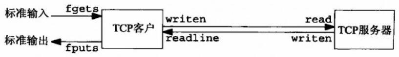

## 5.1 POSIX信号处理

信号（signal）就是告知某个进程发生了某个事件的通知，有时也称为软件中断。信号通常是异步发生的，也就是说进程预先不知道信号的准确发生时刻。信号可以:
- 由一个进程发给另一个进程（或自身);
- 由内核发给某个进程。

调用sigaction函数来设定一个信号的处置，并有三种选择：
1. 提供一个函数，只要有特定信号发生它就被调用。这样的函数称为信号处理函数(signal handler),这种行为称为捕获(catching)信号。有两个信号不能被捕获，它们是SIGKILL和STGSTOP。
2. 把某个信号的处置设定为SIG_IGN来忽略（ignore）它。SIGKIL,t和SIGSTOP这两个信号不能被忽略。
3. 把某个信号的处置设定为SIG_DFL来启用它的默认(default）处置。SICCHLD和STGURG(带外数据到达时发送）默认处置为忽略。

signal函数：
```c++
#include <signal.h>
typedef	void	Sigfunc(int);

Sigfunc* signal(int signo, Sigfunc *func)
{
	struct sigaction	act, oact;
    //设置处理函数
	act.sa_handler = func;
    //设置处理函数的信号掩码
    //设置为空集，意味着在该信号处理函数运行期间，不阻塞额外的信号。
	sigemptyset(&act.sa_mask);
	act.sa_flags = 0;
	if (signo == SIGALRM) {
#ifdef	SA_INTERRUPT
        //在被捕获的信号是SIGALRM时设置它。
		act.sa_flags |= SA_INTERRUPT;	/* SunOS 4.x */
#endif
	} else {
#ifdef	SA_RESTART
        //设置SA_RESTART标志
        //由相应信号中断的系统调用将由内核自动重启。
		act.sa_flags |= SA_RESTART;		/* SVR4, 44BSD */
#endif
	}
    //调用sigaction函数
	if (sigaction(signo, &act, &oact) < 0)
		return(SIG_ERR);
	return(oact.sa_handler);
}
```
## 5.2 处理SIGCHLD信号

设置僵死（zombie）状态的目的是维护子进程的信息，以便父进程在以后某个时候获取。这些信息包括子进程的进程ID、终止状态以及资源利用信息(CPU时间、内存使用量等等)。

如果一个进程终止，而该进程有子进程处于僵死状态，那么它的所有僵死子进程的父进程ID将被重置为1(init进程)。继承这些子进程的init进程将清理它们也就是说init进程将wait它们，从而去除它们的僵死状态)。

### 处理僵死进程
建立一个俘获SIGCHID信号的信号处理函数： 
```c++
void sig_chld(int signo)
{
	pid_t	pid;
	int		stat;
	pid = wait(&stat);//wait将阻塞到现有子进程第一个终止为止
	printf("child %d terminated\n", pid);
	return;
}
```
### 处理被中断的系统调用
适用于慢系统调用的基本规则是:当阻塞于某个慢系统调用的一个进程捕获某个信号且相应信号处理函数返回时，该系统调用可能返回一个EINTR错误。

为了处理被中断的accept,对accept的调用从for循环开始改起,如下所示:
```c++
for (;;) {
    clilen = sizeof(cliaddr);
    if ((connfd = accept(listenfd, (struct sockaddr *)&cliaddr, &clilen)) < 0) {
        if(errno == EINTR)
            continue;
        else {
            printf("accept error \n");
            exit(1);
        }
    }  // if
}
```
## 5.3 wait和waitpid函数
用来清理已终止子进程（僵尸进程）
```c++
#include <sys/wait.h>
pid_t wait(int *statloc) ;
pid_t waitpid(pid_t pid, int*statloc,int options) ;
/*均返回:若成功则为进程D。若出错则为0或-1*/
```
函数wait和waitpid均返回两个值:已终止子进程的进程ID号，以及通过statloc指针返回的子进程终止状态(一个整数)。

- wait      
如果调用wait的进程没有已终止的子进程，不过有一个或多个子进程仍在执行，那么wait将阻塞到现有子进程第一个终止为止。
- waitpid       
pid参数指定想等待的进程ID，值-1表示等待第一个终止的子进程。options参数允许我们指定附加选项，最常用的选项是WNOHANG，它告知内核在没有已终止子进程时不要阻塞。

### 函数wait和waitpid的区别
- 建立一个信号处理函数并在其中调用wait并不足以防止出现僵死进程。多个信号可能在信号处理函数执行之前同时产生，而信号处理函数只执行一次。
- 正确的解决办法是调用waitpid而不是wait：在一个循环内调用waitpid，以获取所有已终止子进程的状态。我们必须指定WNOHANG选项，它告知waitpid在有尚未终止的子进程在运行时不要阻塞。
```c++
void sig_chld(int signo)
{
	pid_t	pid;
	int		stat;
	while ( (pid = waitpid(-1, &stat, WNOHANG)) > 0)
		printf("child %d terminated\n", pid);
	return;
}
```
## 5.4 服务器最终版本
考虑在网络编程时可能会遇到的三种情况:
1. 当fork子进程时，必须捕获STGCHLD信号
2. 当捕获信号时，必须处理被中断的系统调用
3. SIGCHLD的信号处理函数必须正确编写，应使用waitpid函数以免留下僵死进程。

最终版本：
- TCP回射服务端程序：[tcpserv]()    
- TCP回射客户端程序：[tcpcli]()

## 5.5 accept返回前连接中止

ESTABLISHED状态的连接在调用accept之前收到RST(复位)

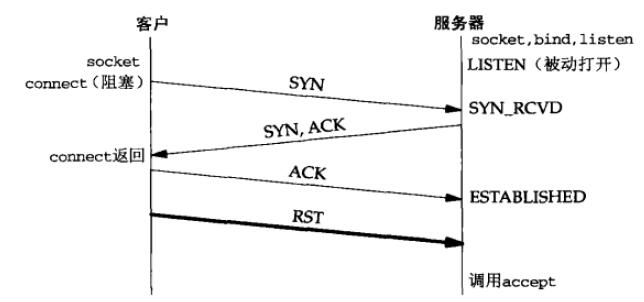

该问题将在内核中处理，服务器进程看不到：将返回一个ECONNVABORTED错误给服务器进程，作为accept的返回结果。服务器就可以忽略它，再次调用accept就行。
> select函数和正常阻塞模式下的监听套接字组合时将产生问题

## 5.6 服务器进程终止

当FIN到达套接字时，客户正阻塞在fgets调用上。客户实际上在应对两个描述符——套接字和用户输入，它不能单纯阻塞在这两个源中某个特定源的输入上，而是应该阻塞在其中任何一个源的输入上。
>事实上这正是select和poll这两个函数的目的之一

## 5.7 SIGPIPE信号

当一个进程向某个己收到RST的套接字执行写操作时，内核向该进程发送一个SIGPIPE信号。该信号的默认行为是终止进程，因此进程必须捕获它以兔不情愿地被终止。不论该进程是捕获了该信号并从其信号处理函数返回，还是简单地忽略该信号，写操作都将返回EP工PE错误。

## 5.8 服务器主机崩溃

客户最终还是会发现对端主机已崩溃或不可达，不过有时候我们需要比不得不等待9分钟更快地检测出这种情况。所用方法就是对readline调用设置一个超时。

这种情形只有向服务器主机发送数据时才能检测出它己经崩溃。如果不主动向它发送数据也想检测出服务器主机的崩溃，那么需要采用另外一个技术：SO_KEEPALIVE套接字选项。

## 5.9 服务器主机崩溃后重启

如果对客户而言检测服务器主机崩溃与否很重要，即使客户不主动发送数据也要能检测出来，就需要采用其他某种技术（诸如SO_KEEPALIVE套接字选项或某些客户/服务器心搏函数),

## 5.10 服务器主机关机

Unix系统关机时，init进程通常先给所有进程发送SIGTERM信号(该信号可被捕获)，等待一段固定的时间，然后给所有仍在运行的进程发送SIGKILL信号（该信号不能被捕获)。

如果不捕获SIGTERM信号并终止，服务器将由SIGKILL信号终止。当服务器子进程终止时，它的所有打开着的描述符都被关闭，随后发生的步骤与服务器进程终止一样。正如那一节所述，必须在客户中使用select或poll函数，使得服务器进程的终止一经发生，客户就能检测到。

# 第六章 I/O复用：select和poll函数

内核一旦发现进程指定的一个或多个IO条件就绪（也就是说输入已准备好被读取，或者描述符已能承接更多的输出)，它就通知进程。这个能力称为IO复用（IO multiplexing)，是由select和pol1这两个函数支持的。

IO复用典型使用在下列网络应用场合：
- 当客户处理多个描述符（通常是交互式输入和网络套接字）时，必须使用IO复用。
- 一个客户同时处理多个套接字是可能的。
- 如果一个TCP服务器既要处理监听套接字，又要处理已连接套接字，一般就要使用IO复用。
- 如果一个服务器即要处理TCP，又要处理UDP。
- 如果一个服务器要处理多个服务或者多个协议，一般就要使用IO复用。

## 6.1 I/O模型
- 阻塞式I/O;
- 非阻塞式IO;
- IO复用(select和poll);
- 信号驱动式IO (SIGIO);
- 异步IO (POSIX的aio_系列函数)。

### 阻塞式I/O 模型
默认情形下，所有套接字都是阻塞的。以数据报套接字作为例子：

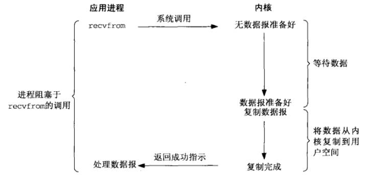

### 非阻塞式I/O 模型

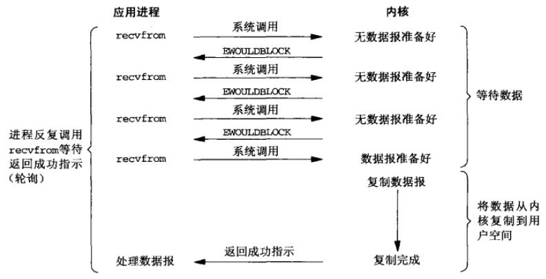

### IO复用 模型

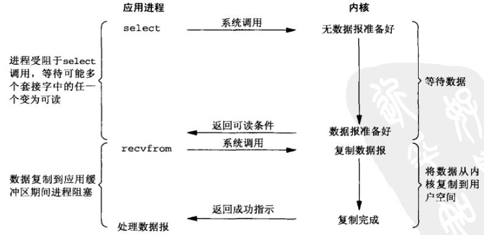

### 信号驱动式IO 模型

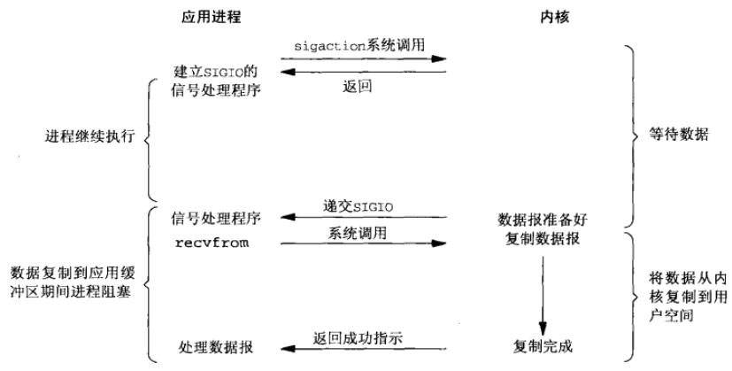

### 异步IO 模型

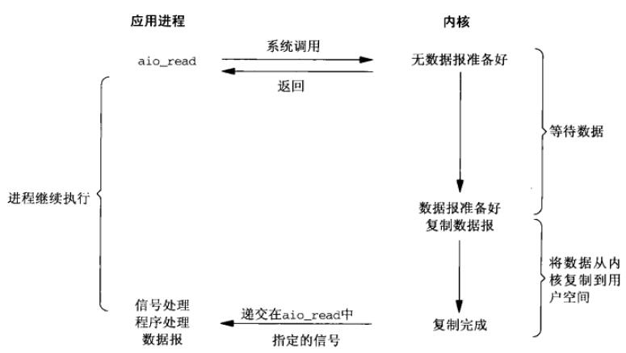

### 各种IO模型的比较

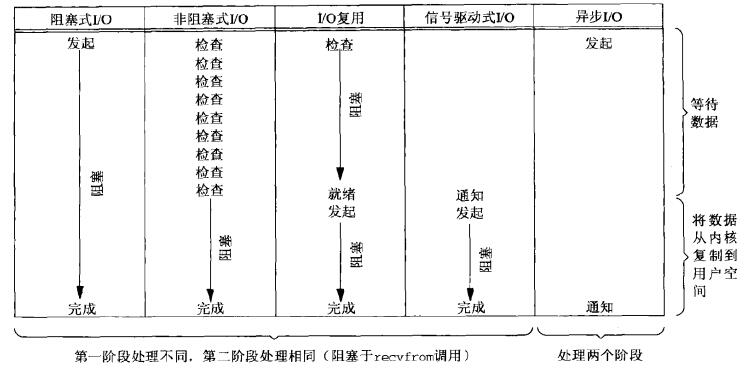

## 6.2 se1ect 函数

该函数允许进程指示内核等待多个事件中的任何一个发生，并只在有一个或多个事件发生或经历一段指定的时间后才唤醒它。
```c++
include <sys/select.h>
includc <sys/time.h>
int select(int maxfdpl ,fd_set *readset,fd_set *writeset,fd_set *exceptset,
           const struct timeval *timeout);
/*返回:若有就绪描述符则为其数目，若超时则为0，若出错则为-1*/
```
- maxfdpl参数指定待测试的描述符个数，它的值是待测试的最大描述符加1（描述符是从0开始的）
- readset、writeset、exceptset 指定要让内核测试读、写和异常条件的描述符。目前支持的异常条件只有两个：
    1. 某个套接字的带外数据的到达;
    2. 某个己置为分组模式的伪终端存在可从其主端读取的控制状态信息。
- timeout 它告知内核等待所指定描述符中的任何一个就绪可花多长时间。其timeval结构用于指定这段时间的秒数和微秒数。
    ```c++
    struct timeval {
        long tv_sec;    /*seconds */
        long tv_usec;   /*microseconds */
    };
    ```
    这个参数有以下三种可能：
    1. 永远等待下去：仅在有一个描述符准备好IO时才返回。为此，我们把该参数设置为空指针。
    2. 等待一段固定时间：在有一个描述符准备好IO时返回，但是不超过由该参数所指向的timeval结构中指定的秒数和微秒数。
    3. 根本不等待：检查描述符后立即返回，这称为轮询(polling)。为此，该参数必须指向一个timeval结构，而且其中的定时器值（由该结构指定的秒数和微秒数）必须为0。

select使用描述符集指定一个或多个描述符值，通常是一个整数数组，其中每个整数中的每一位对应一个描述符。
```c++
void FD_ZERO (fd_set *fcset) ;          /* clear all bits in fdset */
void FD_SET(int fd, fd_set * jdser) ;   /* turn on the bit for fd in fdset */
void FD_CLR(int fl，fd_set * jidset) ;  /* trun off the bit for fd in fdset */
int FD_ISSET (int fd,fd_act *fdset ) ;  /* is the bit for fd on in fdset ? * /
```
调用该函数时，我们指定所关心的描述符的值，该函数返回时，结果将指示哪些描述符已就绪。该函数返回后，我们使用FD_ISSET宏来测试fd_set数据类型中的描述符。描述符集内任何与未就绪描述符对应的位返回时均清成0。为此，每次重新调用select函数时,我们都得再次把所有描述符集内所关心的位均置为1。

 ## 6.3 描述符就绪条件

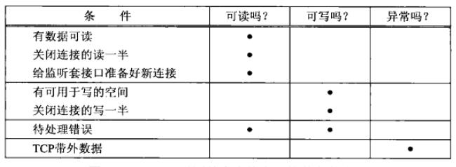

## 6.4 shutdown函数

终止网络连接的通常方法是调用close函数。不过close有两个限制,却可以使用shutdown来避免:
1. close把描述符的引用计数减1，仅在该计数变为0时才关闭套接字。使用shutdown可以不管引用计数就激发TCP的正常连接终止序列。
2. close终止读和写两个方向的数据传送。既然TCP连接是全双工的，有时候我们需要告知对端我们已经完成了数据发送，即使对端仍有数据要发送给我们。(半关闭)

```c++
#inc1ude <sys/socket.h>
int shutdown (int sockfd,int howto) ; /*返回:若成功则为0，若出错则为-1*/
```
该函数的行为依赖于howto参数的值；
- SHUT_RD   关闭连接的读这一半——套接字中不再有数据可接收,而且套接字接收缓冲区中的现有数据都被丢弃。
- SHUT_WR   关闭连接的写这一半——对于TCP套接字，这称为半关闭。当前留在套接字发送缓冲区中的数据将被发送掉，后跟TCP的正常连接终止序列。
- SHUT_RDWR 连接的读半部和写半部都关闭——这与调用shutdown两次等效:第一次调用指定SHLT_RD，第二次调用指定SHUT_WR。

## 6.5 TCP回射服务器程序 (select)

- TCP回射服务端程序：[tcpserv_select]()    
- TCP回射客户端程序：[tcpcli_select]()

### 拒绝服务型攻击

当一个服务器在处理多个客户时，它绝对不能阻塞于只与单个客户相关的某个函数调用。否则可能导致服务器被挂起，拒绝为所有其他客户提供服务。这就是所谓的拒绝服务(denial of service）型攻击。

可能的解决办法包括:
1. 使用非阻塞式IO
2. 让每个客户由单独的控制线程提供服务（例如创建一个子进程或一个线程来服务每个客户);
3. 对I/O操作设置一个超时。

## 6.6 poll函数

poll提供的功能与select类似，不过在处理流设备时，它能够提供额外的信息。
```c++
#include <poll.h>
int poll(struct pollfd *fdarray,unsigned long nfds,int timeout);
/*返回:若有就绪描述符则为其数目，若超时则为0，若出错则为-1*/
```
- fdarray参数 是指向一个结构数组第一个元素的指针。每个数组元素都是一个pollfd结构，用于指定测试某个给定描述符fd的条件。
    ```c++
    struct pollfd {
        int     fd;         /* descriptor to check */
        short   events;     /*events of intereet on fd */
        short   revents;    /*events that occurred on fa */
    };
    ```
    要测试的条件由events成员指定，函数在相应的revents成员中返回该描述符的状态。

    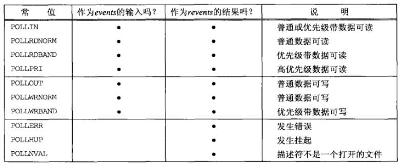

    poll识别三类数据:普通(normal)、优先级带(priority band）和高优先级(high priority)

- timeout参数 指定poll函数返回前等待多长时间。它是一个指定应等待毫秒数的正值。

    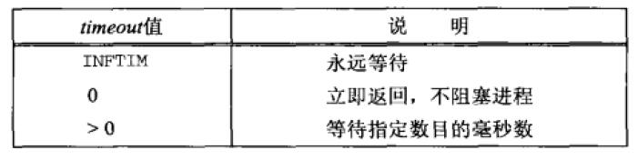

    > INFTIM常值被定义为一个负值。如果系统不能提供毫秒级精度的定时器，该值就向上含入到最接近的支持值。

当发生错误时，poll函数的返回值为-1，若定时器到时之前没有任何描述符就绪，则返回0，否则返回就绪描述符的个数，即revents成员值非0的描述符个数。

## 6.7 TCP回射服务器程序 (poll)

- TCP回射服务端程序：[tcpserv_poll]()    
- TCP回射客户端程序：[tcpcli_poll]()


## 6.8 epoll函数

select的套接字等待集合为fd_set，poll的套接字等待集合为pollfd结构体。但是由于select和poll的套接字等待集合的容量太小，一般是1024，使得进程不能同时处理大规模I/O请求，因此引入epoll。

poll提供了三个函数，epoll_create是创建一个epoll句柄；epoll_ctl是注册要监听的事件类型；epoll_wait则是等待事件的产生。

### epoll_create
```c++
#include <sys/epoll.h>
int epoll_create(int size); /*返回：若成功则为epoll文件描述符，若出错则为-1*/
```
- 参数size用来设置epoll将要监听的描述符的个数。
> 注意，这个size参数和select函数的第一个参数maxfdp1有所不同：maxfdp1定义待测试的最大描述符+1，但是size是硬性的数量，若size=6，则意味epoll通知了内核有6个描述符正要被监听。

需要终止时，与其他文件描述符相同，也要调用close函数。

### epoll_ctl
```c++
#include <sys/epoll.h>
int epoll_ctl(int epfd, int op, int fd, struct poll_event *event); 
/*返回：若成功则为0，若出错则为-1*/
```
- epfd参数 为注册监视对象的epoll文件描述符
- op参数 用于制定监视对象的添加、删除或更改等操作
    - EPOLL_CTL_ADD：注册文件描述符
    - EPOLL_CTL_DEL：删除文件描述符
    - EPOLL_CTL_MOD：修改注册的文件描述符
- fd参数 为需要注册的监视对象文件描述符
- event参数 为监视对象的事件类型。epoll 通过epoll_event结构体保存事件的文件描述符集合。
    ```c++
    struct epoll_event {
        __uint32_t events;
        epoll_data_t data;
    };
    typedef union epoll_data {
        void *ptr;
        int fd;
        __uint32_t u32;
        __uint64_t u64;
    } epoll_data_t;
    ```
    调用语句：
    ```c++
    struct epoll_event event;
    ...
    event.events=EPOLLIN;//发生需要读取数据的情况时
    event.data.fd=sockfd;
    epoll_ctl(epfd,EPOLL_CTL_ADD,sockfd,&event);
    ...
    ```
    events 中可以保存的常量及所指的事件类型:
    - EPOLLIN：需要读取数据的情况
    - EPOLLOUT：输出缓冲为空，可以立即发送数据的情况
    - EPOLLPRI：收到紧急数据(OOB)数据的情况
    - EPOLLRDHUP：断开连接或半关闭的情况，这在边缘触发方式下非常有用
    - EPOLLERR：发生错误的情况
    - EPOLLET：以边缘触发的方式得到事件通知
    - EPOLLONESHOT：发生一次事件后，相应文件描述符不再收到事件通知。因此需要向 epoll_ctl 函数的第二个参数传递 EPOLL_CTL_MOD ，再次设置事件。

### epoll_wait
```c++
#include <sys/epoll.h>
int epoll_wait(int epfd, struct epoll_event *events, int maxevents, int timeout);
/*返回：若成功则为发生事件的文件描述符，若失败则为 -1*/
```
- epfd参数 为注册监视对象的epoll文件描述符
- events和为maxevents分别为保存发生事件的文件描述符集合的结构体地址和最大事件数
- timeout 指定epoll函数返回前等待多长时间。

### 水平触发和边缘触发

epoll有EPOLLLT和EPOLLET两种触发模式，LT是默认的模式，ET是“高速”模式。

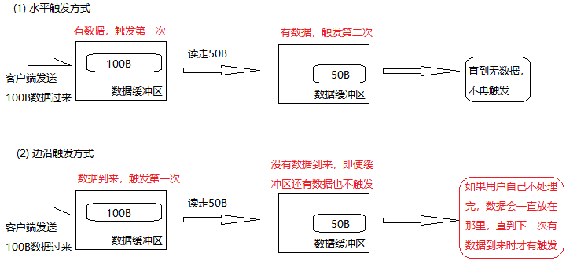

**水平触发**

水平触发(LT)方式中，只要输入缓冲有数据就会一直通知该事件，即只要fd对应的缓冲区有数据epoll_wait就会返回，返回的次数和发送数据的次数没有关系，这是epoll默认的工作模式。

**水平触发的时机：**

- 对于读操作，只要缓冲内容不为空，LT模式返回读就绪。
- 对于写操作，只要缓冲区还不满，LT模式会返回写就绪。

select 模型是以条件触发的方式工作的

epoll为什么要有EPOLLET触发模式？
> 如果采用EPOLLLT模式的话，系统中一旦有大量你不需要读写的就绪文件描述符，它们每次调用epoll_wait都会返回，这样会大大降低处理程序检索自己关心的就绪文件描述符的效率.。而采用EPOLLET这种边缘触发模式的话，当被监控的文件描述符上有可读写事件发生时，epoll_wait()会通知处理程序去读写。如果这次没有把数据全部读写完(如读写缓冲区太小)，那么下次调用epoll_wait()时，它不会通知你，也就是它只会通知你一次，直到该文件描述符上出现第二次可读写事件才会通知你,这种模式比水平触发效率高，系统不会充斥大量你不关心的就绪文件描述符。

**边缘触发**

边缘触发(ET)方式中，输入缓冲收到数据时仅注册 1 次该事件。即使输入缓冲中还留有数据，也不会再进行注册。即检测到有 I/O 事件时，通过 epoll_wait 调用会得到有事件通知的文件描述符，对于每一个被通知的文件描述符，如可读，则必须将该文件描述符一直读到空，让 errno 返回 EAGAIN 为止，否则下次的 epoll_wait 不会返回余下的数据，会丢掉事件。如果ET模式不是非阻塞的，那这个一直读或一直写势必会在最后一次阻塞。
> read 函数发现输入缓冲中没有数据可读时返回 -1，同时在 errno 中保存 EAGAIN 常量

- 阻塞边沿触发 block-ET     
    fd文件属性默认为阻塞，client给server发一次数据，server的epoll_wait就返回一次，无论缓冲区是否还有数据，都只返回一次，此时如果使用while(recv())可以读完数据，但是读到最后一次recv()会阻塞。
- 非阻塞边沿触发nonblock-ET     
    这个就是在阻塞的基础上更改fd的属性，可以利用open函数或者fcntl函数更改
    ```c++
    #include <fcntl.h>
    int fcntl(int fields, int cmd, ...);
    /*返回：成功则为 cmd 参数相关值，若失败则为 -1*/
    ```
    - filedes : 属性更改目标的文件描述符
    - cmd : 表示函数调用目的
        - F_GETFL:获得第一个参数所指的文件描述符属性（int 型）
        - F_SETFL:更改文件描述符属性

    将文件（套接字）改为非阻塞模式，需要如下  2 条语句:
    ```c++
    int flag = fcntl(fd,F_GETFL,0);
    fcntl(fd,F_SETFL,flag|O_NONBLOCK)
    ```
**边缘触发的时机:**

对于读操作:
- 当缓冲区由不可读变为可读的时候，即缓冲区由空变为不空的时候。
- 当有新数据到达时，即缓冲区中的待读数据变多的时候。
- 当缓冲区有数据可读，且应用进程对相应的描述符进行EPOLL_CTL_MOD 修改EPOLLIN事件时。

对于写操作:
- 当缓冲区由不可写变为可写时。
- 当有旧数据被发送走，即缓冲区中的内容变少的时候。
- 当缓冲区有空间可写，且应用进程对相应的描述符进行EPOLL_CTL_MOD 修改EPOLLOUT事件时。
-----
**总结：**
- ET模式（边缘触发）：只有数据到来才触发，不管缓存区中是否还有数据，缓冲区剩余未读尽的数据不会导致epoll_wait返回；
- LT 模式（水平触发，默认）：只要有数据都会触发，缓冲区剩余未读尽的数据会导致epoll_wait返回。

## 6.9 TCP回射服务器程序(epoll)

- TCP回射服务端程序：[tcpserv_epoll]()    
- TCP回射客户端程序：[tcpcli_epoll]()

# 第七章 套接字选项

## 7.1 getsockopt和setsockopt函数
这两个函数仅用于套接字。
- setsockopt从*optvat中取得选项待设置的新值；
- getsockopt则把已获取的选项当前值存放到*optval中；
```c++
#include <sys/socket.h>
int getsockopt(int sockfd, int level,int optname,void *optval,socklen_t *optlen);
int setsockopt (int sockfd, int level,int optname,const void *optval,socklen_t optlen);
/*均返回:若成功则为0。若出错则为-1*/
```
- sockfd必须指向一个打开的套接字描述符
- level(级别)指定系统中解释选项的代码或为通用套接字代码，或为某个特定于协议的代码（例如IPv4、IPv6、TCP或SCTP)。
- optval是一个指向某个变量(*optval)的指针

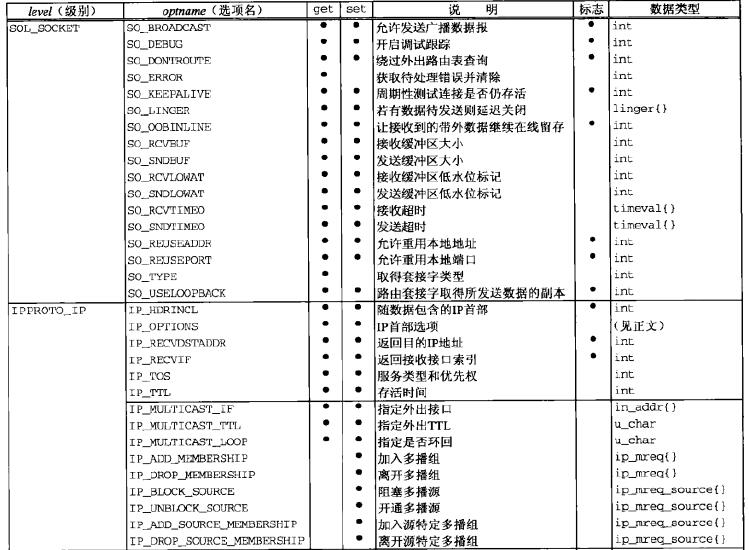

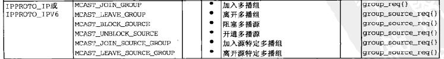

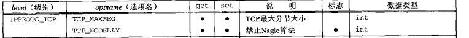

## 7.2 fcntl函数
fcntl函数可执行各种描述符控制操作。

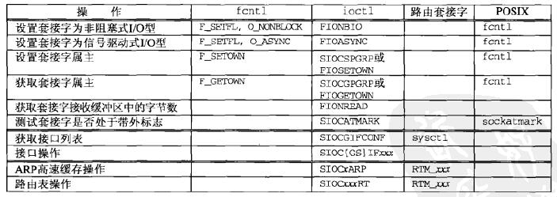

- 非阻塞式I/O       
通过使用F_SETFL命令设置O_NONBLOCK文件状态标志，我们可以把一个套接字设置为非阻塞型。
- 信号驱动式IO      
通过使用F_SETFL命令设置O_ASYNC文件状态标志，我们可以把一个套接字设置成一旦其状态发生变化，内核就产生一个STGIO信号。
- F_SETOWN命令允许我们指定用于接收STGIO和SIGURC信号的套接字属主(进程ID或进程组ID)。     
其中STGIO信号是套接字被设置为信号驱动式I/O型后产生的，SIGURG信号是在新的带外数据到达套接字时产生的

```c++
#include <fcntl.h>
int fcntl(int fd，int cmd,... /* int arg */ );
/*返回,若成功则取决于cmd，若出错则为-1*/
```
每种描述符（包括套接字描述符）都有一组由F_GETFL命令获取或由F_SETFL命令设置的文件标志。其中影响套接字描述符的两个标志是:
- O_NONBLOCK-———非阻塞式I/O;
- O_ASYNC———信号驱动式IO。

# 第八章 基本UDP套接字编程

UDP是无连接不可靠的数据报协议，非常不同于TCP提供的面向连接的可靠字节流。使用UDP编写的一些常见的应用程序有:DNS(域名系统)、NFS（网络文件系统）和SNMP(简单网络管理协议)。

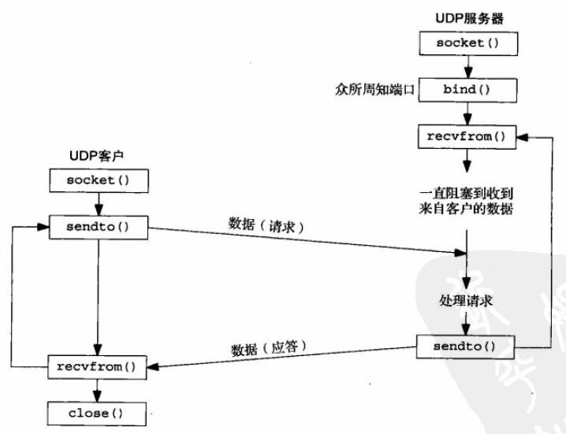

## 8.1 recvfrom和sendto函数
这两个函数类似于标准的read和write函数，不过需要三个额外的参数。
```c++
#include <sys/socket.h>
ssize_t recvfrom (int sockfd, void *buff, size_t nbytes,int flags ,
                  struct sockaddr *from, socklen_t *addrlen );
ssize_t sendto(int sockfil,const void *buff, size_t nbytes, int flags ,
               const struct sockaddr *to,socklen_t *addrlen ) ;
/*均返回:若成功则为读或写的字节数，若出错则为-l*/
```
- 前三个参数sockfd、buff和nbytes等同于read和write函数的三个参数:描述符、指向读入或写出缓冲区的指针和读写字节数。
- sendto的to参数指向一个含有数据报接收者的协议地址（例如IP地址及端口号）的套接字地址结构，其大小由addrlen参数指定。
- recvfrom的from参数指向一个将由该函数在返回时填写数据报发送者的协议地址的套接字地址结构，而在该套接字地址结构中填写的字节数则放在addrlen参数所指的整数中返回给调用者。
> 注意，sendto的最后一个参数是一个整数值，而recvfrom的最后一个参数是一个指向整数值的指针（即值-结果参数)。

## 8.2 UDP 回射C/S 程序

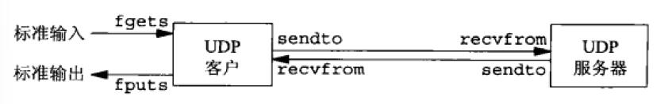

从客户角度总结UDP客户/服务器

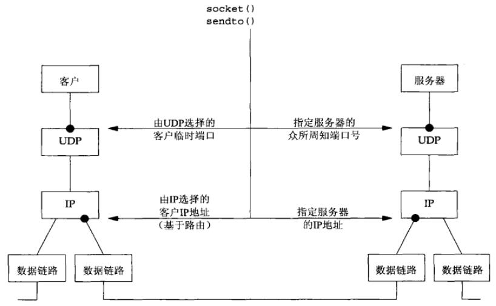

从服务器角度总结UDP客户/服务器

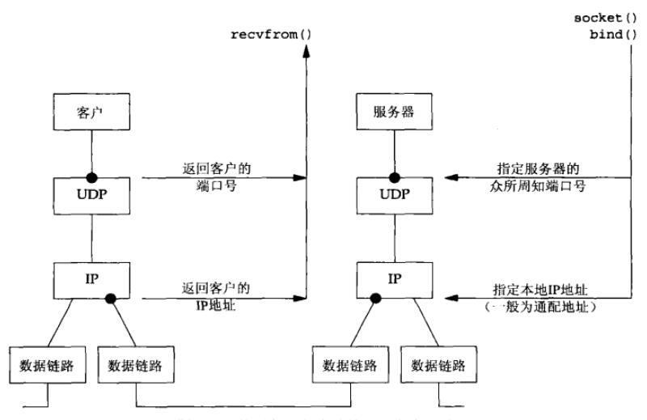

服务器可从到达的IP数据报中获取的信息

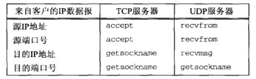

未连接UDP C/S 程序：

- TCP回射服务端程序：[udpserv]()    
- TCP回射客户端程序：[udpcli]()

### UDP的connect函数 

UDP套接字调用connect:没有三路握手过程。内核只是检查是否存在立即可知的错误，记录对端的IP地址和端口号(取自传递给connect的套接字地址结构)，然后立即返回到调用进程。
- 未连接UDP套接字(unconnected UDP socket)，新创建UDP套接字默认如此;
- 已连接UDP套接字(connected UDP socket)，对UDP套接字调用connect的结果。

对于已连接UDP套接字，与默认的未连接UDP套接字相比，发生了三个变化:
1. 再也不能给输出操作指定目的IP地址和端口号。也就是说，不使用sendto,而改用write或send。
2. 不必使用recvfrom以获悉数据报的发送者，而改用read、recv或recvmsg。
3. 由已连接UDP套接字引发的异步错误会返回给它们所在的进程，而未连接UDP套接字不接收任何异步错误。

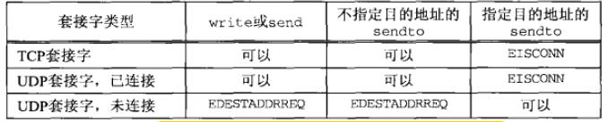

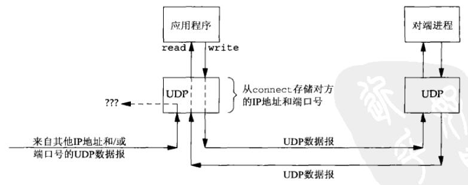

### 给一个UDP套接字多次调用connect

拥有一个已连接UDP套接字的进程可出于下列两个目的之一再次调用connect:
- 指定新的IP地址和端口号;
- 断开套接字。

连接UDP C/S 程序：

- TCP回射服务端程序：[udpserv_cnt]()    
- TCP回射客户端程序：[udpcli_cnt]()

## 8.2 UDP 回射C/S 程序 (select)

- TCP回射服务端程序：[udpserv_select]()    
- TCP回射客户端程序：[udpcli_select]()

# 第九章 线程

fork调用存在一些问题：
- fork是昂贵的。fork要把父进程的内存映像复制到子进程,并在子进程中复制所有描述符，等等。
- fork返回之后父子进程之间信息的传递需要进程间通信（IPC)机制。

线程的创建可能比进程的创建快10~100倍。同一进程内的所有线程共享相同的全局内存。这使得线程之间易于共享信息，然而伴随这种简易性而来的却是同步(synchronization)问题。

同一进程内的所有线程除了共享全局变量外还共享;
- 进程指令:
- 大多数数据;
- 打开的文件（即描述符);
- 信号处理函数和信号处置;
- 当前工作目录;
- 用户ID和组ID。

不过每个线程有各自的:
- 线程ID;
- 寄存器集合,包括程序计数器和栈指针;
- 栈(用于存放局部变量和返回地址);
- errno;
- 信号掩码;
- 优先级。

## 9.1 基本线程函数:创建和终止

### pthread_create函数
当一个程序由exec启动执行时，称为初始线程(initial thread)或主线程(main thread)的单个线程就创建了。其余线程则由pthread_create函数创建。
```c++
#include <pthread.h>
int pthread_create(pthread_t *tid,const pthread_attr_t *attr ,
                   void * (* func) (void *) , void *arg) ;
/*返回:若成功则为0。若出错则为正的Exxx值*/
```
- tid指针 返回成功创建的线程ID。
- attr指针 指定每个线程的属性:优先级、初始栈大小、是否应该成为一个守护线程，等等
- func和arg 为该线程执行的函数及其参数。

### pthread_ join函数
可以通过调用pthread_join等待一个给定线程终止。对比线程和UNIX进程，pthread_create类似于fork，pthread_join类似于waitpid。
```c++
#include <pthread.h>
int pthread_join (pthread_t *tid, void **status ) ;
/*返回:若成功则为0，若出错则为正的Exxx值*/
```
- tid 要等待线程的tid ,Pthread没有办法等待任意一个线程
- status指针 如果非空，来自所等待线程的返回值(一个指向某个对象的指针)将存入由status指向的位置。

### pthread_ self函数
每个线程都有一个在所属进程内标识自身的ID。线程ID由pthread_create返回，而且已经看到pthread_join使用它。每个线程使用pthread_self获取自身的线程ID。
```c++
#include <pthread.h>
pthread_t pthread_self (void) ;
/*返回:调用线程的线程ID*/
```
对比线程和UNIX进程,pthread_self类似于getpid。

### pthread_detach函数
一个线程或者是可汇合的(joinable，默认值)，或者是脱离的(detached)。当一个可汇合的线程终止时，它的线程ID和退出状态将留存到另一个线程对它调用pthread_join。脱离的线程却像守护进程，当它们终止时，所有相关资源都被释放，我们不能等待它们终止。

pthread_detach函数把指定的线程转变为脱离状态。
```c++
#include <pthread.h>
int pthread_detach (pthread_t tid) ;
/*返回:若成功则为0。若出错则为正的Exxxe值*/
```
本函数通常由想让自己脱离的线程调用，就如以下语句: `pthread_detach (pthread_self());`

### pthread_exit函数
让一个线程终止的方法之一是调用pthread_exit。
```c++
#include <pthread.h>
void pthread_exit (void *status ) ;
/*不返回到调用者*/
```
让一个线程终止的另外两个方法是:
- 启动线程的函数（即pthread_create的第三个参数）可以返回。既然该函数必须声明成返回一个void指针，它的返回值就是相应线程的终止状态。
- 如果进程的main函数返回或者任何线程调用了exit，整个进程就终止，其中包括它的任何线程。

## 9.2 使用线程的TCP回射服务器程序

- TCP回射服务端程序：[udpserv_thread]()    
- TCP回射客户端程序：[udpcli_thread]()


 


