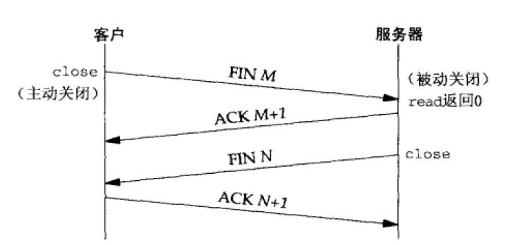
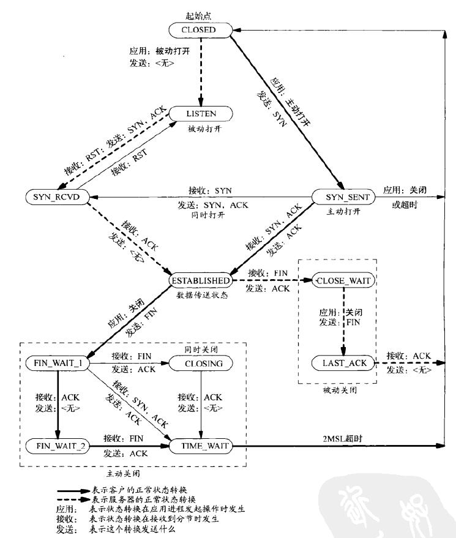

# 第一章 简介

客户与服务器使用TCP在同一个以太网中通信


## 1.1 一个简单的时间获取客户程序

代码：C: [daytimetcpcli]() C++: [daytimetcpcli]()

## 1.2 一个简单的时间获取服务器程序

代码：C: [daytimetcpsrv]() C++: [daytimetcpsrv]()

## 1.3 OSI模型

OSI模型和网际协议族中的各层


## 1.4 测试网络

- netstat -i  提供网络接口的信息。指定-n标志以输出数值地址。
- netstat -r  展示路由表，也是另一种确定接口的方法。
- ifconfig    获得每个接口的详细信息。
- ping        找出本地网络中众多主机的IP地址

# 第二章 传输层 TCP和UDP

## 2.1 概述


TCP/IP协议概况：

- IPv4  
网际协议版本4 (Internet Protocol version 4)。IPv4（通常称之为IP）是网际协议族的主力协议。它使用32位地址。IPv4给TCP、UDP、SCTP、ICMP和IGMP提供分组递送服务。
- IPv6  
网际协议版本6 (Internet Protocol version 6)。IPv6是为IPv4的一个替代品设计的。其主要变化是使用128位更大地址。IPv6给TCP、UDP、SCTP和ICMPv6提供分组递送服务。
- TCP   
传输控制协议(Transmission Control Protocol)。 TCP是一个面向连接的协议，为用户进程提供可靠的全双工字节流。TCP套接字是一种流套接字( streamsocket)。TCP关心确认、超时和重传之类的细节。大多数因特网应用程序使用TCP。注意TCP既可以使用IPv4，也可以使用IPv6。
- UDP   
用户数据报协议(User Datagram Protocol)。UDP是一个无连接协议。UDP套接字是一-种数据报套接字(datagram socket）。UDP数据报不能保证最终到达它们的目的地。与TCP一样，UDP既可以使用IPv4，也可以使用IPv6。
- SCTP  
流控制传榆协议(Stream Control Transmission Protocol)。SCTP是一个提供可靠全双工关联的面向连接的协议，我们使用“关联”一词来指称SCTP中的连接,因为SCTP是多宿的，从而每个关联的两端均涉及一组IP地址和一个端口号。SCTP提供消息服务，也就是维护来自应用层的记录边界。与TCP和UDP一样，SCTP既可以使用IPv4，也可以使用IPv6，而且能够在同一个关联中同时使用它们。
- ICMP  
网际控制消息协议（Internet Control Message Protocol)。ICMP处理在路由器和主机之间流通的错误和控制消息。这些消息通常由TCP/IP网络支持软件本身(而不是用户进程)产生和处理，不过图中展示的ping和traceroute程序同样使用ICMP。有时我们称这个协议为ICMPv4，以便与ICMPv6相区别。
- IGMP  
网际组管理协议(Internet Group Management Protocol )。IGMP用于多播，它在IPv4中是可选的。
- ARP   
地址解析协议（Address Resolution Protocol)。ARP把一个IPv4地址映射成一个硬件地址（如以太网地址)。ARP通常用于诸如以太网、令牌环网和FDDI等广播网络，在点到点网络上并不需要。
- RARP  
反向地址解析协议(Reverse Address Resolution Protocol)。RARP把一个硬件地址映射成一个IPv4地址。它有时用于无盘节点的引导。
- ICMPv6    
网际控制消息协议版本6 (Internet Control Message Protocol version 6)。ICMPv6综合了ICMPv4、IGMP和1ARP的功能。
- BPF   
BSD分组过滤器(BSD packet filter)。该接口提供对于数据链路层的访问能力,通常可以在源自Berkeley的内核中找到。
- DLPI  
数据链路提供者接口(datalink provider interface)。该接口也提供对于数据链路层的访问能力，通常随SVR4内核提供。

## 2.2 用户数据报协议(UDP)

UDP不保证UDP数据报会到达其最终目的地，不保证各个数据报的先后顺序跨网络后保持不变，也不保证每个数据报只到达一次。它缺乏可靠性，提供无连接的服务。

## 2.3 传输控制协议(TCP)

TCP 提供了可靠性，它提供的是数据的可靠递送或故障的可靠通知。再次,TCP提供流量控制（flow control)，TCP总是告知对端在任何时刻它一次能够从对端接收多少学节的数据，这称为通告窗口(advertised window)。最后，TCP连接是全双工的(full-duplex)。这意味着在一个给定的连接上应用可以在任何时刻在进出两个方向上既发送数据又接收数据。

## 2.4 TCP连接的建立和终止

### TCP连接（三次握手）


1. 服务器必须准备好接受外来的连接。通过调用socket、bind和listen这3个函数来完成，我们称之为被动打开（passive open)。
2. 客户通过调用connect发起主动打开(active open),这导致客户TCP发送一个SYN（同步）分节，它告诉服务器客户将在（待建立的）连接中发送的数据的初始序列号。通常SYN分节不携带数据，其所在IP数据报只含有一个IP首部、一个TCP首部及可能有的TCP选项。
3. 服务器必须确认（ACK）客户的SYN，同时自己也得发送一个SYN分节，它含有服务器将在同一连接中发送的数据的初始序列号。服务器在单个分节中发送SYN和对客户SYN的ACK(确认)。
4. 客户必须确认服务器的SYN。

### TCP选项

- MSS选项     
发送SYN的TCP一端使用本选项通告对端它的最大分节大小(maximumsegment size)即MSS，也就是它在本连接的每个TCP分节中愿意接受的最大数据量。
- 窗口规模选项      
TCP连接任何一端能够通告对端的最大窗口大小是65535，因为在TCP首部中相应的字段占16位。
- 时间戳选项      
这个选项对于高速网络连接是必要的，它可以防止由失而复现的分组可能造成的数据损坏。

### TCP连接终止（四次挥手）



1. 某个应用进程首先调用close，我们称该端执行主动关闭（active close)。该端的TCP于是发送一个FIN分节,表示数据发送完毕。
2. 接收到这个FIN的对端执行被动关闭( passive close),这个FIN由TCP确认。它的接收也作为一个文件结束符（end-of-file）传递给接收端应用进程（放在已排队等候该应用进程接收的任何其他数据之后)，因为FIN的接收意味着接收端应用进程在相应连接上再无额外数据可接收。
3. 一段时间后，接收到这个文件结束符的应用进程将调用close关闭它的套接字。这导致它的TCP也发送一个FIN。
4. 接收这个最终FIN的原发送端TCP（即执行主动关闭的那一端)确认这个FIN。

### TCP状态转换图



自ESTABLISHED状态引出的两个箭头处理连接的终止。如果某个应用进程在接收到一个FIN之前调用close（主动关闭)，那就转换到FIN_WAIT_1状态。但如果某个应用进程在ESTABLISHED状态期间接收到一个FIN（被动关闭)，那就转换到CLOSE_WAIT状态。


### 观察分组

TCP连接的分组交换


### TIME_WAIT状态

TIME_WAIT状态的持续时间是最长分节生命期(maximum segment lifetime，MSL)的两倍(2MSL)，持续时间在1分钟到4分钟之间.MSL是任何IP数据报能够在因特网中存活的最长时间.

TIME_WAIT状态有两个存在的理由:
1. 可靠地实现TCP全双工连接的终止;
> 执行主动关闭的那一端是处于TIME_WAIT状态的那一端:因为可能不得不重传最终那个ACK
2. 允许老的重复分节在网络中消逝。
> TCP必须防止来自某个连接的老的重复分组在该连接已终止后再现

## 2.5 端口号

- 服务端定义了一组众所周知的端口(well-known port)，用于标识众所周知的服务。
- 客户通常使用短期存活的临时端口(ephemeral port)。

**端口号的分配**


1. 众所周知的端口为0～1023。这些端口由IANA分配和控制。
2. 已登记的端口(registered port)为1024~49151。这些端口不受IANA控制，不过由IANA登记并提供它们的使用情况清单，以方便整个群体。
3. 49152~65535是动态的（dynamic）或私用的（private）端口。IANA不管这些端口。临时端口

**套接字对**

一个TCP连接的套接字对(socket pair)是一个定义该连接的两个端点的四元组:本地P地址、本地TCP端口号、外地IP地址、外地TCP端口号。

标识每个端点的两个值（IP地址和端口号）通常称为一个套接字。

## 2.6 缓冲区大小及限制

- IPv4数据报的最大大小是65535字节，包括IPv4首部。
- IPv6数据报的最大大小是65575字节，包括40字节的IPv6首部。
- 许多网络有一个可由硬件规定的MTU（最大传输单元）。以太网的MTU是1500字节。IPv4要求的最小链路MTU是68字节。IPv6要求的最小链路MTU为1280字节。
- 在两个主机之间的路径中最小的MTU称为路径MTU(path MTU)。1500字节的以太网MTU是当今常见的路径MTU。
- 当一个IP数据报将从某个接口送出时，如果它的大小超过相应链路的MTU，IPv4和IPv6都将执行分片( fragmentation)。
- IPv4首部的“不分片(don 't fragment)”位(即DF位）若被设置，那么不管是发送这些数据报的主机还是转发它们的路由器，都不允许对它们分片。
- IPv4和IPv6都定义了最小重组缓冲区大小(minimum reassembly buffer size)，它是IPv4或IPv6的任何实现都必须保证支持的最小数据报大小。其值对于TPv4为576字节，对于IPv6为1500字节。
- TCP有一个MSS (maximum segment size，最大分节大小)，用于向对端TCP通告对端在每个分节中能发送的最大TCP数据量。

### TCP输出

应用进程写TCP套接字时涉及的步骤和缓冲区


每一个TCP套接字有一个发送缓冲区，可以使用SO_SNDBUF套接字选项来更改该缓冲区的大小.

### UDP输出

应用进程写UDP套接字时涉及的步骤和缓冲区


## 2.7 标准因特网服务


# 第三章 套接字编程简介

## 3.1 套接字地址结构

### IPv4套接字地址结构

IPv4套接字地址结构以sockaddr_in命名，定义在`<netinet/in.h>`头文件中。
```c++
struct in_addr {
    in_addr_t   s_addr ;            /*32-bit IPv4 address */
                                    /*network byte ordered */
};
struct sockaddr_in {
    uint8_t         sin_len;        /*length of structure (16)*/
    sa_family_t     sin_family;     /*AF_INET*/
    in_port_t       sin_port;       /*16-bit TCP or UDP port number */
                                    /*network byte ordered */
    struct in_addr  sin_addr;       /*32-bit IPv4address */
                                    /*network byte ordered */
    char            sin_zero[8];    /*unused*/
};
```


### 通用套接字地址结构

`<sys/socket.h>头文件`
```c++
struct sockaddr {
    uint8_t     sa_len;    
    sa_family_t sa_family;      /*address fanily : AF_xxx va1ue */
    char        sa_data[14];    /*protocol-apecific address */
};
```
这要求对套接字函数的任何调用都必须要将指向特定于协议的套接字地址结构的指针进行类型强制转换，变成指向某个通用套接字地址结构的指针，例如:
```c++
int bind(int, struct sockaddr * ,socklen_t} ;

struct sockaddr_in serv;    /*IPv4 socket address structure */
/*fill in serv{ } */
bind (sockfd,(struct sockaddr *)&serv,sizeof(serv));
```
## 3.2 值-结果参数

1. 从进程到内核传递套接字地址结构


从进程到内核传递套接字地址结构的函数有3个: bind、connect和sendto。这些函数的一个参数是指向某个套接字地址结构的指针，另一个参数是该结构的整数大小。
> 既然指针和指针所指内容的大小都传递给了内核，于是内核知道到底需从进程复制多少数据进来。

```c++
struct sockaddr_in  serv;
/*fill in serv{}*/
connect (sockfd,(struct sockaddr*)&serv. sizeof(serv);
```

2. 从内核到进程传递套接字地址结构


从内核到进程传递套接字地址结构的函数有4个: accept、recvfram、getsockname和getpeername。这4个函数的其中两个参数是指向某个套接字地址结构的指针和指向表示该结构大小的整数变量的指针。
```c++
struct sockaddr_un  cli;/*Unix domain */
socklen_t len;

len = sizeof(cli);     /* len is a value */
getpeername (unixfd,(struct sockaddr *)&cli, &len) ;
/*len may have changed */
```
把套接字地址结构大小这个参数从一个整数改为指向某个整数变量的指针，其原因在于:       
> 当函数被调用时，结构大小是一个值(value)，它告诉内核该结构的大小，这样内核在写该结构时不至于越界;当函数返回时，结构大小又是一个结果(resut)，它告诉进程内核在该结构中究竟存储了多少信息。这种类型的参数称为值-结果（value-result）参数。

## 3.3 字节排序函数

考虑一个16位整数，它由2个字节组成。内存中存储这两个字节有两种方法:
- 一种是将低序字节存储在起始地址，这称为小端(little-endian）字节序;
- 另一种方法是将高序字节存储在起始地址,这称为大端(big-endian）字节序。


确定主机字节序的程序: [byteorder]()

主机字节序和网络字节序之间转换函数：
```c++
#include <netinet/in.h>
uint16_t htons (uint16_t host16bitvlue);
uint32_t htonl (uint32_t host32bitvalue);   /*均返回:网络字节序的值*/

uint16_t ntohs (uint16_t net16bitvalue);
uint32_t ntohl (uint32_t net32bitvalue);    /*均返回:主机字节序的值*/
```
> h代表host，n代表network，s代表short(16位)，l代表long(32位)

## 3.4 字节操纵函数

**Berkeley函数(BSD)**
```c++
#include <strings.h>
void bzero (void *dest ,size_t nbytes );
void bcopy (const void *src,void *dest, size_t nbytes );
int bcmp (const void *ptr1, const void *ptr2 , size_t nbytes);
/*返回:若相等则为0，否则为非O*/
```
- bzero把目标字节串中指定数目的字节置为0。(初始化套接字地址结构)
- bcopy将指定数目的字节从源字节串移到目标字节串。
- bcmp 比较两个任意的字节串，若相同则返回值为0，否则返回值为非0。

**ANSI C函数**
```c++
#include <string.h>
void *memset (void *dest,int c,size_t len) ;
void *memcpy (void *dest,const void *src,size_t nbytes ) ;
int memcmp(const void *ptr1,const void *ptr2,size_t nbytes) ;
/*返回:若相等则为0，否则为非O*/
```
- memset把目标字节串指定数目的字节置为值c。
- mermcpy类似bcopy，不过两个指针参数的顺序是相反的。当源字节串与目标字节串重叠时，bcopy能够正确处理，但是memcpy的操作结果却不可知。(改用memmove函数)。
- memcmp比较两个任意的字节串，若相同则返回0，否则返回一个非0值，是大于0还是小于0则取决于第一个不等的字节:如果ptr1所指字节串中的这个字节大于ptr2所指字节中的对应字节，那么大于0，否则小于0。(前提:两个不等的字节均为无符号字符(unsigned char))

## 3.5 地址转换函数

```c++
#iniclude <arpa/inet.h>
int inet_aton(const char *strptr,struct in_addr *addrptr) ;
/*返回:若字符串有效则为1，否则为0*/
in_addr_t inet_addr (const char *strptr ) ; /*废弃*/
/*返回:若字符串有效则为32位二进制网络字节序的IPv4地址，否则为工NADDR_NONE*/
char *inet_ntoa (struct in_addr inaddr ) :
/*返回:指向一个点分十进制数串的指针*/
```
- inet_ator将strptr所指C字符串转换成一个32位的网络字节序二进制值，并通过指针addrptr来存储。若成功则返回1，否则返回0。
- inet_addr进行相同的转换，返回值为32位的网络字节序二进制值。(不能处理255.255.255.255，已被废弃)
- inet_ntoa函数将一个32位的网络字节序二进制IPv4地址转换成相应的点分十进制数串。

IPv6出现的新函教:(适用于IPv4地址和IPv6地址)     
```c++
include <arpa/inet.h>
int inet_ptcn(int family,corst char *strpir ,void *addrptr ) ;
/*返回:若成功则为1，若输入不是有效的表达格式则为0，若出错则为-1*/
const char *inet_ntop (int family，const void *addrptr,char *strptr,size_t len);
/*返回:若成功则为指向结果的指针，若出错则为NULL*/
```
> p和n分别代表表达( presentation）和数值（numeric)。
- inet_ptcn 函数尝试转换由strptr指针所指的字符串，并通过addrptr指针存放二进制结果。若成功则返回值为1，否则如果对所指定的family而言输入的字符串不是有效的表达格式，那么返回值为0。
- inet_ntop 函数进行相反的转换，从数值格式(addrptr）转换到表达格式(strptr)。len参数是目标存储单元的大小，以免该函数溢出其调用者的缓冲区。

## 3.6 字节流套接字函数
```c++
#include <unistd.h>
#include <errno.h>
ssize_t readn ( int filedes,void *buff,size_t nbytes ) ;
ssize_t written(int filedes ,const void *buff ,size_t nbytes ) ;
ssize_t readline(int filedes,void *buff, size_t maxlen) ;
/*均返回:读或写的字节数，若出错则为-1*/
```
- [readn]()
- [written]()
- [readline]()

# 第四章 基本TCP套接字编程


## 4.1 socket函数
为了执行网络IO，一个进程必须做的第一件事情就是调用socket函数，指定期望的通信协议类型。
```c++
#include <sys/socket.h>
int socket(int family, ine type, int protocol);
/*返回:若成功则为非负描述符,若出错则为-1*/
```
- family参数指明协议族

- type参数指明套接字类型

- protocol参数应设为某个协议类型常值，或者设为0，以选择所给定family和type组合的系统默认值。

- 并非所有套接字family与type的组合都是有效的


## 4.2 connect函数
TCP客户用connect函数来建立与TCP服务器的连接。
```c++
#include <sys/socket.h>
int connect (int sockfd,const struct sockaddr *servaddr,socklen_t addrlen);
/*返回:若成功则为0，若出错则为-1*/
```
- sockfd是由socket函数返回的套接字描述符
- servaddr和addrlen分别是一个指向套接字地址结构的指针和该结构的大小

> 客户在调用函数connect前不必非得调用bind函数，因为如果需要的话，内核会确定源IP地址，并选择一个临时端口作为源端口。

出错返回的几种情况：  

1. 若TCP客户没有收到SYN分节的响应，则返回ETIMEDOUT错误。
2. 若对客户的SYN的响应是RST(表示复位)，则表明该服务器主机在我们指定的端口上没有进程在等待与之连接。这是一种硬错误(hard error)，客户一接收到RST就马上返回ECONNREFUSED错误。
3. 若客户发出的SYN在中间的某个路由器上引发了一个“destination unreachable”(目的地不可达）ICMP错误，则认为是一种软错误(soft error)。

connect函数导致当前套接字从CLOSED状态（该套接字自从由socket函数创建以来一直所处的状态）转移到SYN_SENT状态，若成功则再转移到ESTABLISHED状态。若connect失败则该套接字不再可用，必须关闭，我们不能对这样的套按字再次调用connect函数。

## 4.3 bind函数

bind函数把一个本地协议地址赋予一个套接字。对于网际网协议，协议地址是32位的IPv4地址或128位的IPv6地址与16位的TCP或UDP端口号的组合。
```c++
#include <sye/socket.h>
int bind(int sockfd,const struct sockaddr *myaddr,socklen_t addrlen);
/*返回:若成功则为0，若出错则为-1*/
```
- sockfd是由socket函数返回的套接字描述符
- myaddr和addrlen分别是一个指向特定于协议的地址结构的指针和该地址结构的长度
> 对于TCP，调用bind函数可以指定一个端口号，或指定一个IP地址，也可以两者都指定，还可以都不指定。


- 如果指定端口号为0，那么内核就在bind被调用时选择一个临时端口
- 如果指定IP地址为通配地址，那么内核将等到套接字已连接（TCP）或己在套接字上发出数据报（UDP）时才选择一个本地IP地址。
> 对于IPv4来说，通配地址由常值INADDR_ANY来指定，其值一般为0.
```c++
struct sockaddr_in servaddr ;
servaddr.sin_addr.s_addr = htorl(INADDR_ANY) ;/*wildcard * /
```
> - 可以调用函数getsockname来返回协议地址和端口值
> - 从bind函数返回的一个常见错误是EADDRINUSE (地址已使用)

## 4.4 listen函数
当socket函数创建一个套接字时，它被假设为一个主动套接字，也就是说，它是一个将调用connect发起连接的客户套接字。listen函数把一个未连接的套接字转换成一个被动套接字，指示内核应接受指向该套接字的连接请求。调用listen导致套接字从CLOSED状态转换到LISTEN状态。
```c++
include <sys/socket.h>
int listert int sockfd,int backlog) ;
/*返回:若成功则为0，若出错则为-1*/
```
- sockfd是由socket函数返回的套接字描述符
- backlog规定了内核应该为相应套接字排队的最大连接个数。

内核为任何一个给定的监听套接字维护两个队列:
- 未完成连接队列(incomplete connection queue)
   > 每个这样的SYN分节对应其中一项:已由某个客户发出并到达服务器，而服务器正在等待完成相应的TCP三路握手过程。这些套接字处于SYN_RCVD状态（图2-4)。
- 已完成连接队列(completed connection queue)
   > 每个已完成TCP三路握手过程的客户对应其中一项。这些套接字处于ESTABLISHED状态


## 4.5 accept函数

accept函数由TCP服务器调用,用于从已完成连接队列队头返回下一个已完成连接。如果已完成连接队列为空，那么进程被投入睡眠(假定套接字为默认的阻塞方式)。
```c++
#include <sys/socket.h>
int accept (int sockfd,struct sockaddr * cliaddr,socklen_t *addrlen ) ;
/*返回:若成功则为非负描述符，若出错则为-1*/
```
- sockfd是由socket函数返回的套接字描述符（监听描述符）
- cliaddr和addrlen用来返回已连接的对端进程（客户）的协议地址(addrlen是值-结果参数)。

如果accept成功，那么其返回值是由内核自动生成的一个全新描述符，代表与所返回客户的TCP连接(已连接套接字描述符)。

## 4.6 fork和exec函数
该函数（包括有些系统可能提供的它的各种变体）是Unix中派生新进程的唯一方法。
```c++
#include <unistd.h>
pid_t fork (void) :
/*返回:在子进程中为0，在父进程中为子进程ID,若出错则为-1*/
```
- 在调用进程（称为父进程）中返回一次，返回值是新派生进程（称为子进程）的进程ID号;
- 在子进程又返回一次，返回值为0。

父进程中调用fork之前打开的所有描述符在fork返回之后由子进程分享。通常情况下，子进程接着读写这个己连接套接字，父进程则关闭这个已连接套接字。

fork有两个典型用法：    
1. 一个进程创建一个自身的副本,这样每个副本都可以在另一个副本执行其他任务的同时处理各自的某个操作。这是网络服务器的典型用法。
2. 一个进程想要执行另一个程序。既然创建新进程的唯一办法是调用fork，该进程于是首先调用fork创建一个自身的副本，然后其中一个副本（通常为子进程）调用exec把自身替换成新的程序。这是诸如shell之类程序的典型用法。

存放在硬盘上的可执行程序文件能够被Unix执行的唯一方法是:由一个现有进程调用六个exec函数中的某一个。
```c++
#include <unistd.h>
int execl  (const char *pathname,const char *arg0,... /*(char *) 0*/ );
int execv  (const char *pathname,char *const *arg [] );
int execle (const char *pathnane,const char *arg0, .../*(char *) 0, char *const envp []*/) :
int execve (const char *pathnanme,char *const argv[],char *const envp []);
int execlp (const char *filename,const char *arg0,.... /* (char *) 0 */);
int execvp (const char *filenrame, char *const argv[]);
```


## 4.7 并发服务器

典型的并发服务器程序轮廓：
```c++
pid_t pid;
int listenfd, connfd;
listenfd = socket ( ... ) ;
        /*fill in sockaddr_in{ } with server 's well-known port */
bind (listenfd,... ) ;
listen (listenfd,LISTENQ) ;
for ( ; ; ) {
    connfd = Accept (listenfd, ... );/*probably blocks */
    if (pid = Fork()) == 0) {
        close(listenfd);    /*child closes listening soczket */
        doit(connfd);       /*process the request*/
        close(connfd);      /*done with this client */
        exit(0);            /*child terminates */
    }
    close (connfd) ;        /*parent closes connected socket*/
}
```
## 4.8 close函数
Unix close函数也用来关闭套接字，并终止TCP连接。
```c++
#include <unistd.h>
int close (int sockfd ) ; /*返回:若成功则为0，若出错则为-1*/
```
close一个TCP套接字的默认行为是把该套接字标记成已关闭，然后立即返回到调用进程。

## 4.9 getsockname和 getpeername函数
这两个函数或者返回与某个套接字关联的本地协议地址(getsockname)，或者返回与某个套接字关联的外地协议地址( getpeername)。
```c++
#include <sys/socket.h>
int getsocknane (int sockfd,struct sockaddr *localaddr,socklen_t *addrlen ) ;
int getpeername(int sockfd,struct sockaddr *peeraddr,socklen_t *addrlen) ;
/*均返回:若成功则为0。若出错则为-1*/
```
需要这两个函数的理由如下所述；
- 在一个没有调用bind的TCP客户上，connect成功返回后，getsockname用于返回由内核赋予该连接的本地P地址和本地端口号。
- 在以端口号0调用bind（告知内核去选择本地端口号）后，getsockname用于返回由内核赋予的本地端口号。
- getsockname可用于获取某个套接字的地址族
- 在一个以通配IP地址调用bind的TCP服务器上，与某个客户的连接一旦建立(accept成功返回)，getsockname就可以用于返回由内核赋予该连接的本地IP地址      在这样的调用中，套接字描述符参数必须是已连接套接字的描述符，而不是监听套接字的描述符。
- 当一个服务器是由调用过accept的某个进程通过调用exec执行程序时，它能够获取客户身份的唯一途径便是调用getpeername.

获取套接字的地址族：
```c++
int
sockfd_to_family(int sockfd)
{
	struct sockaddr_storage ss;
	socklen_t	len;

	len = sizeof(ss);
	if (getsockname(sockfd, (SA *) &ss, &len) < 0)
		return(-1);
	return(ss.ss_family);
}
```
# 第五章 TCP C/S程序示例

**简单的回射客户/服务器**


## 5.1 POSIX信号处理

信号（signal）就是告知某个进程发生了某个事件的通知，有时也称为软件中断。信号通常是异步发生的，也就是说进程预先不知道信号的准确发生时刻。信号可以:
- 由一个进程发给另一个进程（或自身);
- 由内核发给某个进程。

调用sigaction函数来设定一个信号的处置，并有三种选择：
1. 提供一个函数，只要有特定信号发生它就被调用。这样的函数称为信号处理函数(signal handler),这种行为称为捕获(catching)信号。有两个信号不能被捕获，它们是SIGKILL和STGSTOP。
2. 把某个信号的处置设定为SIG_IGN来忽略（ignore）它。SIGKIL,t和SIGSTOP这两个信号不能被忽略。
3. 把某个信号的处置设定为SIG_DFL来启用它的默认(default）处置。SICCHLD和STGURG(带外数据到达时发送）默认处置为忽略。

signal函数：
```c++
#include <signal.h>
typedef	void	Sigfunc(int);

Sigfunc* signal(int signo, Sigfunc *func)
{
	struct sigaction	act, oact;
    //设置处理函数
	act.sa_handler = func;
    //设置处理函数的信号掩码
    //设置为空集，意味着在该信号处理函数运行期间，不阻塞额外的信号。
	sigemptyset(&act.sa_mask);
	act.sa_flags = 0;
	if (signo == SIGALRM) {
#ifdef	SA_INTERRUPT
        //在被捕获的信号是SIGALRM时设置它。
		act.sa_flags |= SA_INTERRUPT;	/* SunOS 4.x */
#endif
	} else {
#ifdef	SA_RESTART
        //设置SA_RESTART标志
        //由相应信号中断的系统调用将由内核自动重启。
		act.sa_flags |= SA_RESTART;		/* SVR4, 44BSD */
#endif
	}
    //调用sigaction函数
	if (sigaction(signo, &act, &oact) < 0)
		return(SIG_ERR);
	return(oact.sa_handler);
}
```
## 5.2 处理SIGCHLD信号

设置僵死（zombie）状态的目的是维护子进程的信息，以便父进程在以后某个时候获取。这些信息包括子进程的进程ID、终止状态以及资源利用信息(CPU时间、内存使用量等等)。

如果一个进程终止，而该进程有子进程处于僵死状态，那么它的所有僵死子进程的父进程ID将被重置为1(init进程)。继承这些子进程的init进程将清理它们也就是说init进程将wait它们，从而去除它们的僵死状态)。

### 处理僵死进程
建立一个俘获SIGCHID信号的信号处理函数： 
```c++
void sig_chld(int signo)
{
	pid_t	pid;
	int		stat;
	pid = wait(&stat);//wait将阻塞到现有子进程第一个终止为止
	printf("child %d terminated\n", pid);
	return;
}
```
### 处理被中断的系统调用
适用于慢系统调用的基本规则是:当阻塞于某个慢系统调用的一个进程捕获某个信号且相应信号处理函数返回时，该系统调用可能返回一个EINTR错误。

为了处理被中断的accept,对accept的调用从for循环开始改起,如下所示:
```c++
for (;;) {
    clilen = sizeof(cliaddr);
    if ((connfd = accept(listenfd, (struct sockaddr *)&cliaddr, &clilen)) < 0) {
        if(errno == EINTR)
            continue;
        else {
            printf("accept error \n");
            exit(1);
        }
    }  // if
}
```
## 5.3 wait和waitpid函数
用来清理已终止子进程（僵尸进程）
```c++
#include <sys/wait.h>
pid_t wait(int *statloc) ;
pid_t waitpid(pid_t pid, int*statloc,int options) ;
/*均返回:若成功则为进程D。若出错则为0或-1*/
```
函数wait和waitpid均返回两个值:已终止子进程的进程ID号，以及通过statloc指针返回的子进程终止状态(一个整数)。

- wait      
如果调用wait的进程没有已终止的子进程，不过有一个或多个子进程仍在执行，那么wait将阻塞到现有子进程第一个终止为止。
- waitpid       
pid参数指定想等待的进程ID，值-1表示等待第一个终止的子进程。options参数允许我们指定附加选项，最常用的选项是WNOHANG，它告知内核在没有已终止子进程时不要阻塞。

### 函数wait和waitpid的区别
- 建立一个信号处理函数并在其中调用wait并不足以防止出现僵死进程。多个信号可能在信号处理函数执行之前同时产生，而信号处理函数只执行一次。
- 正确的解决办法是调用waitpid而不是wait：在一个循环内调用waitpid，以获取所有已终止子进程的状态。我们必须指定WNOHANG选项，它告知waitpid在有尚未终止的子进程在运行时不要阻塞。
```c++
void sig_chld(int signo)
{
	pid_t	pid;
	int		stat;
	while ( (pid = waitpid(-1, &stat, WNOHANG)) > 0)
		printf("child %d terminated\n", pid);
	return;
}
```
## 5.4 服务器最终版本
考虑在网络编程时可能会遇到的三种情况:
1. 当fork子进程时，必须捕获STGCHLD信号
2. 当捕获信号时，必须处理被中断的系统调用
3. SIGCHLD的信号处理函数必须正确编写，应使用waitpid函数以免留下僵死进程。

最终版本：
- TCP回射服务端程序：[tcpserv]()    
- TCP回射客户端程序：[tcpcli]()


 


